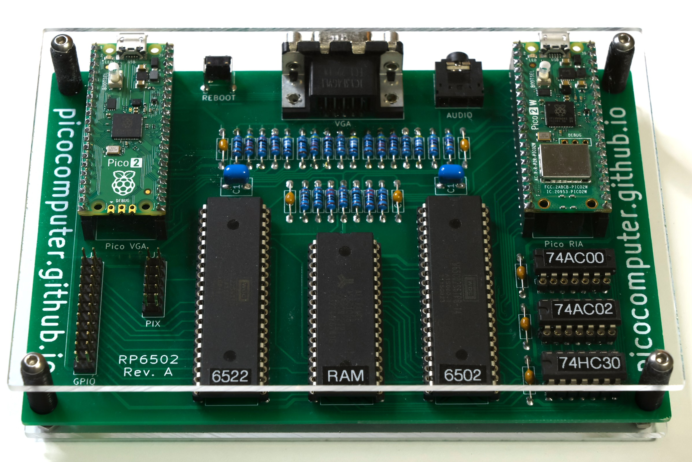

.. toctree::
   :hidden:

   Hardware <hardware>
   RP6502-RIA <ria>
   RP6502-RIA-W <ria_w>
   RP6502-VGA <vga>
   RP6502-OS <os>

==================
Picocomputer 6502
==================

All the soul of the 6502. None of the compromises. You're welcome.

The **Picocomputer 6502** is an open source, modern-retro gaming computer
built around a real WDC 65C02. The design philosophy: keep the essence of
programming a 6502 and 6522, then rethink everything else.

Community
=========

- **Discord:** https://discord.gg/TC6X8kTr6d
- **Forums:** https://github.com/picocomputer/community/discussions
- **Wiki:** https://github.com/picocomputer/community/wiki
- **GitHub:** https://github.com/picocomputer
- **YouTube:** https://youtube.com/playlist?list=PLvCRDUYedILfHDoD57Yj8BAXNmNJLVM2r

Specs
=====

- **CPU** — WDC 65C02 CPU and WDC 65C22 VIA
- **RAM** — 64 KB system + 64 KB extended
- **Video** — VGA and HD output; 3 planes, scanline programmable
- **Sound** — PSG and OPL2 FM
- **Clock** — Real-Time Clock

Connectivity
============

- **USB** — keyboard, mouse, gamepads, UART serial, NFC, floppy drives, and flash drives
- **Bluetooth LE** — keyboard, mouse, and gamepads
- **WiFi** — NTP time sync, Hayes modem emulation for dialing into BBSs

Programming
===========

- **Protected OS** — 32-bit operating system; uses no 6502 RAM
- **POSIX-compatible API** — stdio.h and unistd.h for cc65 and llvm-mos
- **FAT filesystem** — read and write files on any USB flash or floppy drive
- **ROM flash** — 1 MB of onboard flash for installing and auto-booting ROMs

Build It
========

100% through-hole construction. Hundreds of people have built one,
typically for under $100 USD. You can also have a unit manufactured
in China — no soldering required. All parts are currently in production;
the Raspberry Pi Pico 2 is guaranteed until at least January 2040.

- :doc:`hardware`: Schematic and manufacturing information.

Documentation
=============

The Picocomputer 6502 is a reference design for RP6502 modular hardware.
The only required module is the RP6502-RIA.

- :doc:`ria`: Interface adapter for the 6502, akin to CIA, VIA, and ACIA devices.
- :doc:`ria_w`: Wireless features available when using the "Pico 2 W".
- :doc:`vga`: Optional video adapter.
- :doc:`os`: The operating system and application programming interface.

`Please contribute to this documentation.
<https://github.com/picocomputer/picocomputer.github.io>`_
