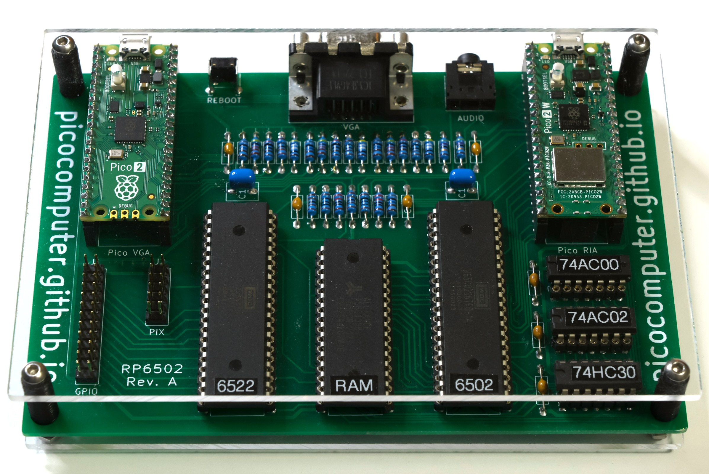

.. toctree::
   :hidden:

   RP6502-PICO <pico>
   RP6502-EMU <emu>
   RP6502-FPGA <fpga>
   RP6502-SDK <sdk>
   RP6502-RIA <ria>
   RP6502-RIA-W <ria_w>
   RP6502-VGA <vga>
   RP6502-TERM <term>
   RP6502-OS <os>

==================
Picocomputer 6502
==================

Pure 6502. No governor. No speed limits.

The **Picocomputer 6502** is an open source, modern-retro gaming computer
built around a real WDC 65C02. The design philosophy is simple: keep the
soul of programming a 6502 and 6522, then rethink everything else.

Community
=========

Most of the action is on Discord, where you can also grab ROMs. Subscribe to
the YouTube channel and share the project around while you're at it.

- **Discord:** https://discord.gg/TC6X8kTr6d
- **Wiki:** https://github.com/picocomputer/community/wiki
- **GitHub Q&A:** https://github.com/picocomputer/community/discussions
- **YouTube:** https://www.youtube.com/@rumbledethumps

Specs
=====

- **Core** — WDC 65C02 CPU and 65C22 VIA, variable from 0.1 to 8.0 MHz
- **RAM** — 64 KB system plus 64 KB extended
- **ROM** — 1 MB of onboard flash for installing and auto-booting ROMs
- **Video** — VGA and HD output, 16-bit color with alpha
- **Sound** — PSG (8 voices) or OPL2 FM (9 voices)
- **Clock** — real-time clock with automatic Daylight Saving Time
- **TRNG** — true random number generator

Quality of Life
===============

- **Open by design** — fully open source hardware and software, friendly to DIY builds
- **Console manifold** — reach the console over telnet, serial, or direct attach
- **Storage** — fast USB flash drive access, over 512 KB/sec read and write
- **Keyboards** — international keyboard layout support
- **Fonts** — built-in code pages for international character sets

Connectivity
============

- **Wi-Fi** — NTP time sync, telnet server, and Hayes modem emulation
- **Bluetooth LE** — keyboards, mice, and gamepads
- **USB host** — keyboards, mice, gamepads, hubs, UART serial, MIDI, NFC, floppy and flash drives
- **USB device** — serial console access with no driver needed (CDC ACM)

Programming
===========

- **Protected OS** — 32-bit operating system that uses no 6502 RAM
- **FAT filesystem** — read and write files on any USB flash or floppy drive
- **POSIX-like API** — a familiar C library for portable code
- **cc65 and llvm-mos** — :doc:`SDK <sdk>` for either 6502 compiler
- **AI assistance** — the latest models via VS Code extensions or GitHub Copilot

Get a Machine
=============

There are three of them, and they are the same computer. Software written
for one runs on the others.

- :doc:`pico`: build the real thing. 100% through-hole construction, no IC
  programmer required. Hundreds of people have built one, typically for
  under $100 USD. Prefer not to solder? You can have a unit manufactured
  in China instead. Every part is currently in production, and the
  Raspberry Pi Pico 2 is guaranteed through at least January 2040.
- :doc:`emu`: software emulation, for Windows, macOS, Linux, Android, and
  the browser. There's a playable one on that page — you can be running
  6502 code in about two seconds.
- :doc:`fpga`: hardware emulation. The whole machine in gates, on an
  Analogue Pocket today and MiSTer next.

Documentation
=============

The Picocomputer 6502 is a reference design for RP6502 modular hardware.
The only required module is the RP6502-RIA.

- :doc:`sdk`: writing software, from a new project to a running program.
- :doc:`ria`: the interface adapter for the 6502, in the spirit of the classic CIA, VIA, and ACIA chips.
- :doc:`ria_w`: the wireless features unlocked by the Pico 2 W.
- :doc:`vga`: the optional video adapter.
- :doc:`term`: the console and its terminal escape sequences.
- :doc:`os`: the operating system and its application programming interface.

`Please contribute to this documentation.
<https://github.com/picocomputer/picocomputer.github.io>`_
