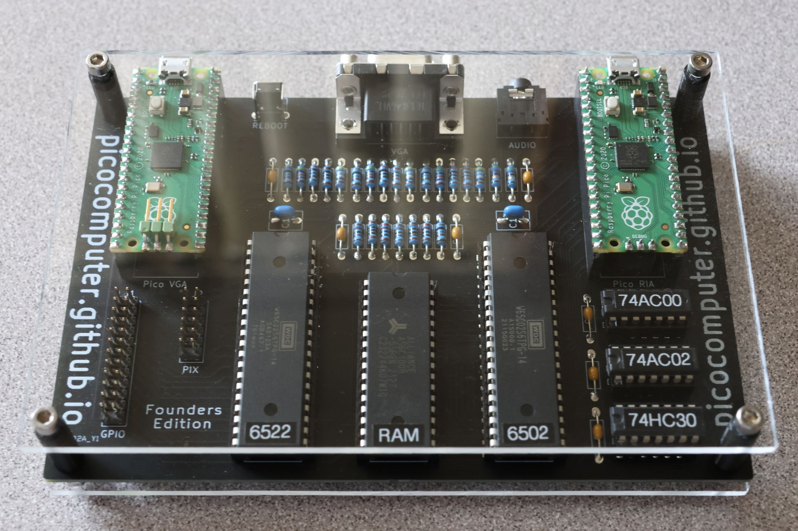

.. toctree::
   :hidden:

   Hardware <hardware>
   RIA <ria>
   RIA W <ria_w>
   VGA <vga>
   API <api>

Picocomputer 6502
=================

The Picocomputer explores retro computing and game development by bridging the void between genuine 8-bit hardware and modern devices.

Key Features
------------
* 64KB of System RAM
* 64KB of Extended RAM
* VGA Graphics
* 8-channel Stereo Sound Generator
* USB for Keyboard, Mouse, and Gamepads
* 100% through-hole

Resources
---------

Please use GitHub and the Forums for support, Discord for casual chat.

* GitHub: https://github.com/picocomputer
* Forums: https://github.com/picocomputer/community/discussions
* Discord: https://discord.gg/TC6X8kTr6d
* Wiki: https://github.com/picocomputer/community/wiki
* YouTube: https://youtube.com/playlist?list=PLvCRDUYedILfHDoD57Yj8BAXNmNJLVM2r

Datasheets
----------

The RP6502 chipset comes in two parts. The RP6502-RIA is an interface adapter that connects to a 6502 much like CIA, VIA, and ACIA devices. The RP6502-VGA is an optional video chip that connects to the RP6502-RIA. Both of these are simply Raspberry Pi Picos with the RP6502 firmware.

* :doc:`Schematic, PCB, and Parts <hardware>`
* :doc:`RIA Interface Adapter <ria>`
* :doc:`VGA Graphics Processing Unit <vga>`
* :doc:`API for 6502 Programing <api>`
