============================
RP6502-SDK
============================

RP6502 - Software Development Kit

Introduction
============

Picocomputer software is distributed as a ROM: one file ending in
``.rp6502``, such as ``game.rp6502``. A ROM describes the state of the
machine as it comes out of reset, and that state is the same every time:
the program and data are in memory, and the reset vector points to where
the program begins. A single ROM can hold every piece of code, video and
audio your game needs. It might also contain the bootloader for an
operating system.

If this sounds a lot like the cartridge ROM of a game console, or the
BASIC ROM in your 8-bit home computer, that's not a coincidence.

The SDK builds a ROM, runs it on a Picocomputer or in the emulator, and
debugs it while it runs. A project starts as a copy of the `RP6502
project template <https://github.com/picocomputer/rp6502-sdk>`__, which
builds with either of two 6502 compilers, cc65 or llvm-mos. The template
includes the same "Hello, world!" program three times: in C, which builds
with either compiler, and in each compiler's assembly syntax.

.. code-block:: text

   src/main.c, src/xram.h,
   src/help.txt, CMakeLists.txt
              │
              │  CMake builds the program with the compiler,
              ▼  and rp6502.py packages it with its assets
   build/cc65/debug/hello.rp6502
              │
        ┌─────┴──────────────────────────┐
        ▼ RP6502 (Emulator)              ▼ RP6502 (Hardware)
   tools/rp6502-emu, with            a Picocomputer, over
   breakpoints and stepping          USB serial or telnet

Getting Started
===============

Install VS Code, and the compilers and other programs listed in the
template's README. On Windows, the README also describes a ``generator``
line to add to ``CMakePresets.json`` after step 1 and before step 3.

**1. Make a project.** On the template's GitHub page, select "Use this
template", then "Create a new repository". GitHub creates a new repository
with a copy of the template. Clone it and open the folder in VS Code.

**2. Install the recommended extensions** when VS Code prompts for them:

- the C/C++ Extension Pack, which includes CMake Tools, to build;
- LLDB DAP, to debug in the emulator;
- Python Debugger, to run the Python tool that sends a ROM to a
  Picocomputer.

**3. Choose a configure preset.** The first time the project opens,
CMake Tools lists four presets, one for each combination of compiler and
build type. Choose a Debug preset, because breakpoints and stepping need
the debug information it builds. Release is the optimized build for a
ROM you share. The preset can be changed later from the Configure row of
the CMake side panel.

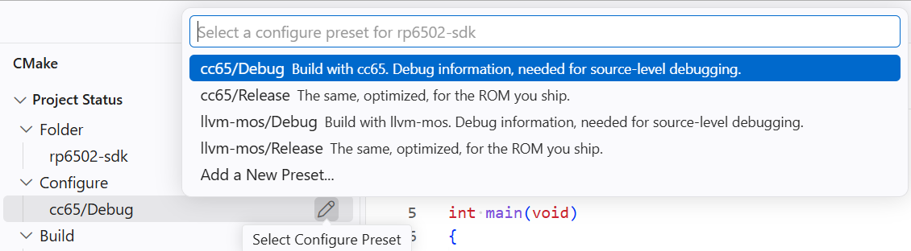
         cc65/Release, llvm-mos/Debug and llvm-mos/Release, above the
         CMake side panel's Configure row.

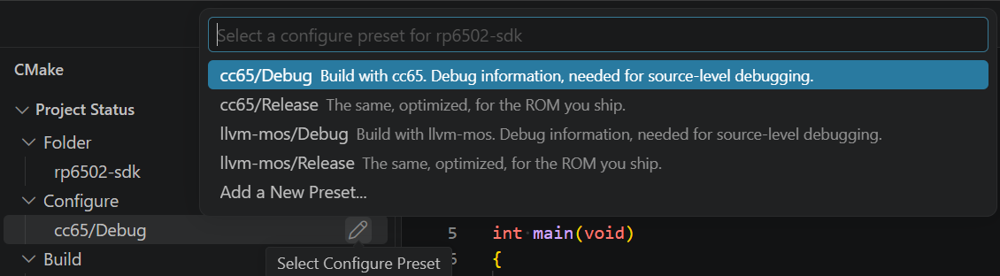
         cc65/Release, llvm-mos/Debug and llvm-mos/Release, above the
         CMake side panel's Configure row.

The first configure downloads the tools into ``tools/``: the CMake
functions, ``rp6502.py``, and the emulator for your system.

**4. Press F5 to debug.** VS Code builds ``hello.rp6502`` and runs it in
the emulator. "Hello, world!" appears on the emulator's screen and in VS
Code's Debug Console. The session stays open after the program ends so
the screen can be read. Stop it with Shift+F5. The emulator window may
open behind VS Code.

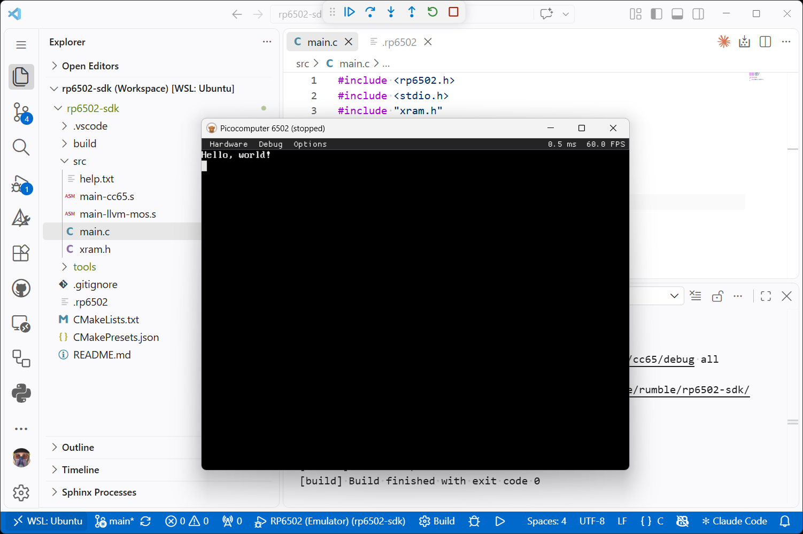
         with its debug toolbar.

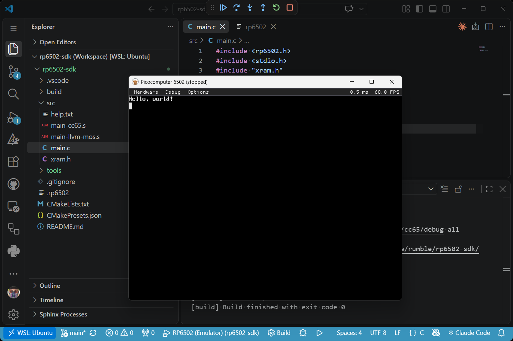
         with its debug toolbar.

The project now looks like this:

.. code-block:: text

   my-project/
   ├── CMakeLists.txt         the ROMs this project builds
   ├── CMakePresets.json      the four configure presets
   ├── README.md              what to install
   ├── .vscode/               F5 configurations, tasks, extensions
   ├── src/
   │   ├── main.c             Hello, world! in C
   │   ├── main-cc65.s        the same in cc65 assembly
   │   ├── main-llvm-mos.s    the same in llvm-mos assembly
   │   ├── xram.h             the XRAM layout
   │   └── help.txt           the help asset
   ├── tools/                 commit these
   │   ├── rp6502.cmake
   │   ├── rp6502.py
   │   ├── cc65-toolchain.cmake
   │   ├── cc65-config.cmake
   │   └── rp6502-emu         the emulator, ignored by git
   ├── build/                 build output, ignored by git
   └── .rp6502                the settings file, ignored by git

On Windows and WSL, the emulator is ``rp6502-emu.exe``.

To start from assembly, replace ``src/main.c`` in ``CMakeLists.txt`` with
``src/main-cc65.s`` or ``src/main-llvm-mos.s``, and delete the two source
files you don't use. An assembly project builds only with its compiler's
presets.

Commit the ``tools/`` folder, so every clone of the project builds with
the same tools. The tools change only when you update them, with the
"RP6502: update tools" task (Terminal > Run Task) or with
``cmake -P tools/rp6502.cmake``. An update replaces each tool file with
the latest version from the rp6502 repository, and local changes to those
files are lost. An update also downloads the latest emulator release. On
Windows, close the emulator before updating.

When ``tools/`` has no emulator, the next configure downloads one, so a
fresh clone needs no extra step. If the release has no emulator for your
system, the configure writes ``tools/rp6502-emu.unsupported``, which
names the missing build. Later configures don't try again until the next
update. Build the emulator from the `rp6502 repository
<https://github.com/picocomputer/rp6502>`__, then set ``emulator`` in
`The .rp6502 Settings File`_ to its path.

Running and Debugging
=====================

"Start Debugging" (F5) runs one of two launch configurations. Choose
which in the Run and Debug side panel.

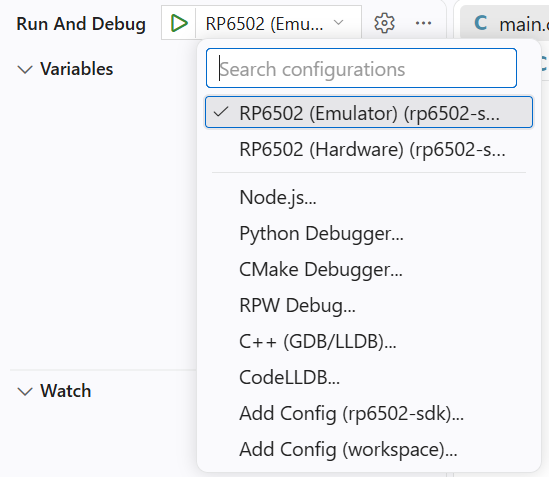
         RP6502 (Hardware).

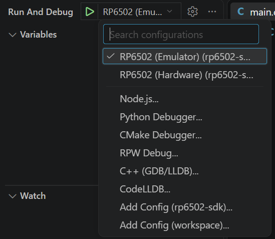
         RP6502 (Hardware).

**RP6502 (Emulator)** is the default. It builds the project and runs it
in the :doc:`emu` with source-level debugging: breakpoints, stepping, the
call stack, variables and watch expressions, all of which need a Debug
preset. With llvm-mos, variables show their C types, and structures and
arrays expand. With cc65, variables have no types, and each variable's
size comes from where its symbol sits in memory.
:ref:`Debugging <emu-debugging>` in the emulator's datasheet covers both.

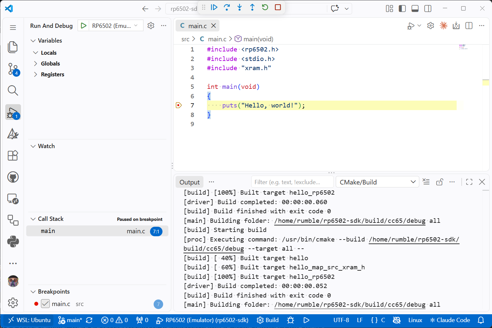
         Call Stack panels.

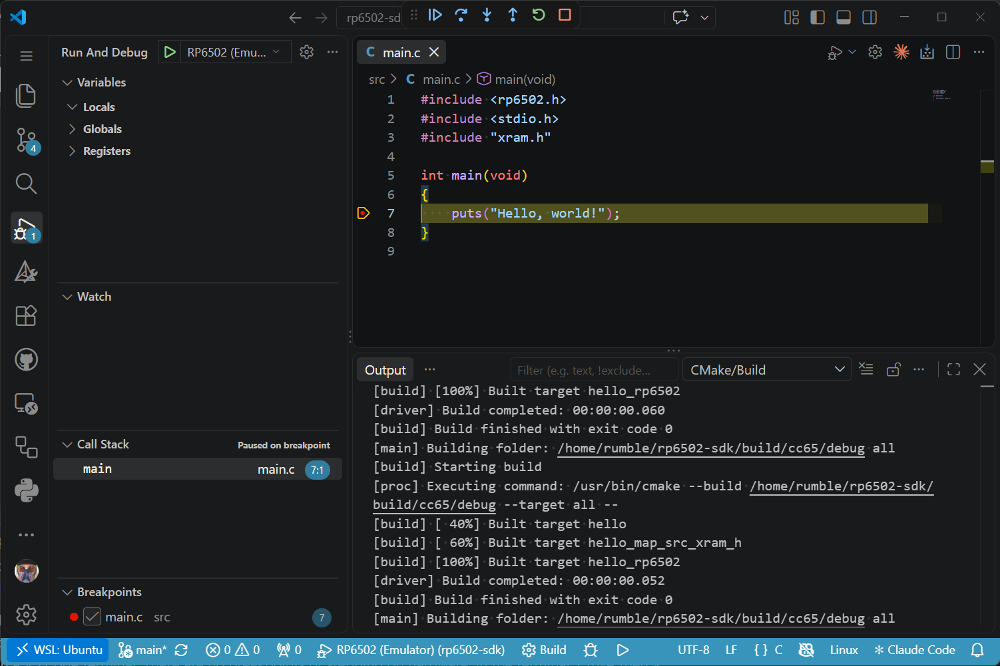
         Call Stack panels.

**RP6502 (Hardware)** builds the project and runs it on an :doc:`pico`.
The connection is USB, through the USB port on the Picocomputer's VGA
module, or telnet with an :doc:`ria_w`. First set ``device``, and ``key``
for telnet, as `The .rp6502 Settings File`_ describes.

The ROM is copied to the current drive and folder of the monitor, the
Picocomputer's command prompt, or to the ``workdir`` folder when the
settings file sets one. It is loaded from there, so a USB drive must be
plugged in. The copy replaces any file with the same name. The program's
console opens in a VS Code terminal. There are no breakpoints or stepping
on hardware. In the terminal, Ctrl-A then X exits, and Ctrl-A then B
sends a break. A break stops the program and returns to the monitor.

Two tasks in Terminal > Run Task use a Picocomputer without starting a
debug session. "RP6502: upload ROM" copies the ROM of the launch target,
the program selected in the Launch row of the CMake side panel, to the
same place without running it. "RP6502: console terminal" opens a
terminal on the console. Both send a break first, which stops the running
program.

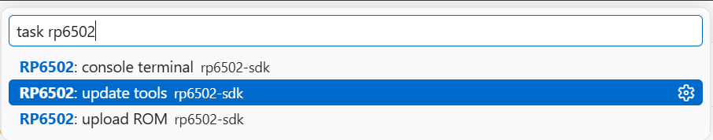
         console terminal.

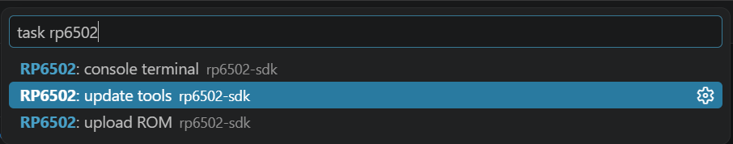
         console terminal.

The .rp6502 Settings File
=========================

The settings file is named ``.rp6502`` and is in the project folder. It is
not a ROM, although it has the same extension. It is created the first
time the tools run. To run on a Picocomputer, set ``device`` in the
``[RP6502][Launch]`` section, and ``key`` as well for telnet.

.. code-block:: text

  [RP6502][Launch]
  emulator = tools/rp6502-emu
  device = /dev/ttyACM0
  key =
  workdir =
  args =
  term = True

.. list-table::
   :widths: 20 80
   :header-rows: 1

   * - Setting
     - Description
   * - ``emulator``
     - Path to the emulator: ``tools/rp6502-emu``, or
       ``tools/rp6502-emu.exe`` on Windows and WSL. A relative path is
       resolved against the settings file's folder. A bare name that isn't
       there, such as ``rp6502-emu``, is looked up on the PATH.
   * - ``device``
     - The Picocomputer's serial port. A new settings file sets it to the
       usual port for your system: ``/dev/ttyACM0`` on Linux, the first
       ``/dev/cu.usbmodem`` device on macOS, or ``COM1`` on Windows. On
       Windows the Picocomputer is usually on a higher COM number, shown
       in Device Manager. When ``key`` is set,
       ``device`` is the Picocomputer's hostname or IP address for telnet,
       with an optional ``:port`` (23 by default).
   * - ``key``
     - Passkey for telnet. Leave it empty to use a serial port. See
       :ref:`Telnet Console <ria-w-telnet-console>`.
   * - ``workdir``
     - Folder at the root of the current drive of the monitor where the
       ROM is copied, such as ``MyGame``. Leave it empty to copy the ROM to
       the current folder of the monitor.
   * - ``args``
     - Arguments for the ROM. The program receives them only when it
       defines ``__argv_mem()``, as :ref:`ARGV <os-argv>` describes.
   * - ``term``
     - Open a terminal on the console when running on a Picocomputer.

The emulator also saves its debugger window layout in this file, so each
project reopens with its windows where you left them.

Building a ROM
==============

``CMakeLists.txt`` describes the ROMs a project builds. This is the
template's:

.. code-block:: cmake

  cmake_minimum_required(VERSION 3.21)

  include(${CMAKE_CURRENT_LIST_DIR}/tools/rp6502.cmake)

  project(MY-RP6502-PROJECT C CXX ASM)

  add_executable(hello)
  rp6502_map(hello src/xram.h "XRAM_.*")
  rp6502_asset(hello help src/help.txt)
  rp6502_executable(hello DATA default RESET default)
  target_sources(hello PRIVATE
      src/main.c
  )

- ``include()`` loads the RP6502 CMake functions from ``tools/``.
- ``add_executable(hello)`` creates the program, a CMake target named
  ``hello``.
- ``rp6502_map()`` reads the XRAM addresses for ``hello`` from
  ``src/xram.h``. See `Addresses in CMake`_.
- ``rp6502_asset()`` adds an asset to the ROM. See `Adding Assets`_.
- ``rp6502_executable()`` packages the program and its assets into
  ``hello.rp6502``, named after the target.
- ``target_sources()`` lists the program's source files.

``rp6502_map()`` and every ``rp6502_asset()`` come after
``add_executable()`` and before ``rp6502_executable()``. ``rp6502_map()``
also comes before any ``rp6502_asset()`` that uses its names.
``target_sources()`` can go anywhere after ``add_executable()``.

The ROM is written to the preset's build folder,
``build/<compiler>/<debug or release>/``, so the cc65 Debug build is
``build/cc65/debug/hello.rp6502``. To share a program, build it with a
Release preset and share that file. It runs on every Picocomputer and in
the emulator, including in a web browser through a
:ref:`web build <emu-web-builds>`.

``rp6502_executable()`` takes these keywords:

.. list-table::
   :widths: 20 80
   :header-rows: 1

   * - Keyword
     - Description
   * - ``DATA``
     - The address the program loads at. Without ``DATA``, the program is
       left out, and the ROM holds only its assets.
   * - ``RESET``
     - The address the 6502 starts running at, stored at
       ``$FFFC-$FFFD``. Required.
   * - ``IRQ``
     - The address of the interrupt handler, stored at ``$FFFE-$FFFF``.
       Optional.
   * - ``NMI``
     - The address of the non-maskable interrupt handler, stored at
       ``$FFFA-$FFFB``. Optional.

Each keyword takes a number, such as ``0x200``, or one of two words:

- ``file`` takes the address from the start of the linker output. Only
  llvm-mos writes addresses there: the load address, then the start
  address.
- ``default`` is ``0x200`` with cc65 and ``file`` with llvm-mos.

Use ``file`` and ``default`` only with ``DATA`` and ``RESET``. Give
``IRQ`` and ``NMI`` a number.

.. _sdk-assets:

Adding Assets
=============

Graphics, level data, help text and any other files the program uses are
packaged into the same ``.rp6502`` file with ``rp6502_asset()``.

.. code-block:: cmake

  rp6502_asset(hello 0x10000 img/intro.bin)
  rp6502_asset(hello help src/help.txt)

An asset with a numeric address is a memory chunk. Before the 6502
starts, the file is loaded to that address in RAM (``$0000-$FEFF``) or in
XRAM (``$10000-$1FFFF``). XRAM is 64 KB of extended memory outside the
6502's address space, described in `XRAM Memory Map`_.

An address can also be written as ``RAM(addr)`` or ``XRAM(addr)``. Both
check that the address is inside RAM or XRAM and stop CMake with an error
if it is not. The file's length is not checked. ``XRAM()`` takes an
address within XRAM, the number the program uses, so ``XRAM(0x1000)``
loads at ``0x11000``.

.. code-block:: cmake
  :force:

  rp6502_asset(hello RAM(0x00F0) bin/f0.bin)
  rp6502_asset(hello XRAM(0x1000) img/tiles.bin)

Any other address is a name, and a named asset is a file the program opens
while it runs. Prefix the name with ``ROM:`` and open it like any other
file. Named assets are read-only, and several can be open at once. To
load one into XRAM, pass its file descriptor to
:ref:`read_xram() <os-read-xram>`.

.. code-block:: C

  open("ROM:help", O_RDONLY);

The asset named ``help`` is the ROM's help text. An :doc:`pico` monitor
shows it with the HELP and INFO commands, and the emulator shows it in the
ROM Help window. The template's help text is ``src/help.txt``.

An asset can also be made by the build, such as an image converted from a
PNG. Create it with ``add_custom_command()`` and pass its output file to
``rp6502_asset()``. Both calls must be in the same ``CMakeLists.txt``,
because CMake connects a generated file to the step that uses it only
within one directory. The paint program in the `examples
<https://github.com/picocomputer/examples>`__ does this.

.. code-block:: cmake

  find_package(Python3 REQUIRED COMPONENTS Interpreter)
  add_custom_command(
      OUTPUT ${CMAKE_CURRENT_BINARY_DIR}/logo.bin
      COMMAND ${Python3_EXECUTABLE}
          ${CMAKE_CURRENT_SOURCE_DIR}/png2bin.py
          ${CMAKE_CURRENT_SOURCE_DIR}/logo.png
          ${CMAKE_CURRENT_BINARY_DIR}/logo.bin
      DEPENDS png2bin.py logo.png
      VERBATIM
  )
  rp6502_asset(hello logo ${CMAKE_CURRENT_BINARY_DIR}/logo.bin)

The build fails if two memory chunks overlap ("ROM data already exists")
or two assets have the same name ("Asset name already exists").

.. _sdk-ram-memory-map:

RAM Memory Map
==============

RAM is ``$0000-$FEFF``, 63.75 KB. The 256 bytes above it are I/O: the
registers of the RIA (the RP6502 Interface Adapter), the VIA, and
unassigned space, as the :ref:`Memory Map <os-memory-map>` of the
operating system shows. Each compiler includes a linker script that lays
out RAM for a program:

.. code-block:: text

            cc65                         llvm-mos
   $0000  ┌────────────────────────┐   ┌────────────────────────┐
          │ zero page              │   │ $00-$1F registers      │
          │                        │   │ $20-$FF zero page      │
   $0100  ├────────────────────────┤   ├────────────────────────┤
          │ 6502 stack             │   │ 6502 stack             │
   $0200  ├────────────────────────┤   ├────────────────────────┤
          │ program, data, heap ↑  │   │ program, data, heap ↑  │
          │                        │   │                        │
   $F700  ├────────────────────────┤   │                        │
          │ C stack ↓              │   │ C stack ↓              │
   $FF00  └────────────────────────┘   └────────────────────────┘

The llvm-mos registers are zero page locations the compiler uses as
extra registers. The 6502 stack is the processor's own 256-byte stack. It
holds return addresses and is too small for C, so each compiler keeps a
second stack, the C stack, at the top of RAM. cc65 keeps local variables
and most function arguments there, and reserves 2 KB for it. llvm-mos
passes arguments in registers when it can, so its C stack is used less.
The llvm-mos heap is limited to 4 KB by default, and a program raises the
limit with ``__set_heap_limit()``.

Most projects keep the default layout. For a different one, copy the
compiler's script into the project, change the copy, and pass it to the
linker with ``target_link_options()``. The scripts are ``cfg/rp6502.cfg``
in the cc65 folder and ``mos-platform/rp6502/lib/link.ld`` in the
llvm-mos folder. With cc65, a script that moves the start of RAM needs
``DATA`` and ``RESET`` given as numbers, because ``default`` is always
``0x200``.

.. code-block:: cmake

  # cc65:
  target_link_options(hello PRIVATE -C ${CMAKE_SOURCE_DIR}/src/hello.cfg)
  # llvm-mos:
  target_link_options(hello PRIVATE -T ${CMAKE_SOURCE_DIR}/src/hello.ld)

The `ld65 documentation <https://cc65.github.io/doc/ld65.html>`__
describes the cc65 script format, and the llvm-mos wiki page `Linker Script
<https://llvm-mos.org/wiki/Linker_Script>`__ describes the llvm-mos format.

.. _sdk-xram-memory-map:

XRAM Memory Map
===============

XRAM is 64 KB of memory outside the 6502's address space. A program reads
and writes it through the :ref:`XRAM portals <ria-extended-ram>` of the
RIA, the RP6502 Interface Adapter. XRAM holds the data for the virtual
devices: keyboard, mouse, tablet and gamepad input, the PSG and OPL2 sound
generators, VGA mode configurations, and the pixels, tiles and sprites the
modes draw. XRAM has no fixed map. You choose an address for each
device's data, and your program gives the device that address by setting
its extended register (XREG) with :ref:`xreg() <os-xreg>`.

A ROM's map is usually kept in one file, ``xram.h`` for C or ``xram.inc``
for assembly. It holds the structure of each device the program uses, and a
layout that places them in XRAM with a name for each address. Add a
device's structure when the program starts using the device, and
rearrange the layout as the data grows. The template's ``src/xram.h`` is
this file, with a placeholder structure, ``xram_feature_t``, to replace.

The structures are in the :doc:`ria` and :doc:`vga` datasheets. Each one is
in a code block labeled ``xram.h`` or ``xram.inc``, together with its
constants and XREG macros. Choose the C, ca65 or llvm-mc tab, then use the
"Copy to clipboard" button in the corner of the block to copy the whole
block into ``xram.h`` or ``xram.inc``.

The structures are not part of ``rp6502.h`` or ``rp6502.inc``. The copy
in ``xram.h`` is the only definition the program uses. Register numbers,
field offsets and sizes never change. Only names can change in the docs,
and a name in the copy can be changed without affecting anything else.

This example is for a program that uses only the keyboard. The keyboard
definitions are the :ref:`Keyboard <ria-keyboard>` block from the
:doc:`ria` datasheet, and the layout after them places the keyboard at
address 0.

.. tab:: C

   .. code-block:: C
      :caption: xram.h

      #ifndef XRAM_H
      #define XRAM_H

      #include <rp6502.h>
      #include <stdbool.h>
      #include <stddef.h>
      #include <stdint.h>

      #define KEYBOARD_NO_KEY 0
      #define KEYBOARD_NUM_LOCK 1
      #define KEYBOARD_CAPS_LOCK 2
      #define KEYBOARD_SCROLL_LOCK 3

      #define KEYBOARD_PRESSED(keys, code) ((keys)[(code) >> 3] & (1 << ((code) & 7)))

      #define xreg_ria_keyboard(...) xreg(0, 0, 0, __VA_ARGS__)

      typedef struct
      {
          uint8_t keys[32];
      } keyboard_t;

      typedef struct
      {
          keyboard_t keyboard;
      } xram_layout_t;

      #define XRAM_KEYBOARD offsetof(xram_layout_t, keyboard)

      #endif

.. tab:: ca65

   .. code-block:: ca65
      :caption: xram.inc

      .ifndef XRAM_INC
      XRAM_INC = 1

      KEYBOARD_NO_KEY      = 0
      KEYBOARD_NUM_LOCK    = 1
      KEYBOARD_CAPS_LOCK   = 2
      KEYBOARD_SCROLL_LOCK = 3

      .macro xreg_ria_keyboard addr
          xreg 0, 0, 0, addr
      .endmacro

      .struct keyboard_t
          keys .res 32
      .endstruct

      .struct xram_layout_t
          keyboard .tag keyboard_t
      .endstruct

      XRAM_KEYBOARD = xram_layout_t::keyboard

      .endif

.. tab:: llvm-mc

   .. code-block:: ca65
      :caption: xram.inc
      :force:

      .ifndef XRAM_INC
      XRAM_INC = 1

      KEYBOARD_NO_KEY      = 0
      KEYBOARD_NUM_LOCK    = 1
      KEYBOARD_CAPS_LOCK   = 2
      KEYBOARD_SCROLL_LOCK = 3

      .macro xreg_ria_keyboard addr
          xreg 0, 0, 0, \addr
      .endm

      KEYBOARD_KEYS = 0
      KEYBOARD_SIZE = 32

      XRAM_KEYBOARD = 0

      .endif

The llvm-mc tab has no structures, so each address is a number. A second
device goes at the previous address plus its size, such as
``XRAM_KEYBOARD + KEYBOARD_SIZE``.

Each ``XRAM_`` name is the address of one part of the layout, and the
program uses these names for every XRAM address. This code maps the
keyboard to its address, then loops until a key is pressed.

.. tab:: C
   :new-set:

   .. code-block:: C

      xreg_ria_keyboard(XRAM_KEYBOARD);
      RIA.addr0 = XRAM_KEYBOARD;
      RIA.step0 = 0;
      while (RIA.rw0 & (1 << KEYBOARD_NO_KEY))
          ;

.. tab:: ca65

   .. code-block:: ca65

          xreg_ria_keyboard XRAM_KEYBOARD
          lda #<XRAM_KEYBOARD
          sta RIA_ADDR0
          lda #>XRAM_KEYBOARD
          sta RIA_ADDR0+1
          lda #0
          sta RIA_STEP0
      :   lda RIA_RW0
          and #1 << KEYBOARD_NO_KEY
          bne :-

.. tab:: llvm-mc

   .. code-block:: ca65
      :force:

          xreg_ria_keyboard XRAM_KEYBOARD
          lda #(XRAM_KEYBOARD & $FF)
          sta RIA_ADDR0
          lda #((XRAM_KEYBOARD >> 8) & $FF)
          sta RIA_ADDR0+1
          lda #0
          sta RIA_STEP0
      1:  lda RIA_RW0
          and #(1 << KEYBOARD_NO_KEY)
          bne 1b

Addresses in CMake
------------------

An asset that loads into XRAM needs its address in ``CMakeLists.txt`` as
well as in the header. This layout adds a 2 KB logo after the keyboard.
Only the changed part of ``xram.h`` is shown.

.. code-block:: C

  typedef struct
  {
      keyboard_t keyboard;
      uint8_t logo[2048];
  } xram_layout_t;

  #define XRAM_KEYBOARD offsetof(xram_layout_t, keyboard)
  #define XRAM_LOGO offsetof(xram_layout_t, logo)

``rp6502_map()`` reads the address names from the header, so each address
is written once, in the header, and never repeated in ``CMakeLists.txt``.

.. code-block:: cmake

  rp6502_map(<target> <header> <regex> [<unaligned_regex>])

.. code-block:: cmake
  :force:

  rp6502_map(hello src/xram.h "XRAM_.*")
  rp6502_asset(hello XRAM(XRAM_LOGO) img/logo.bin)

The regular expression selects which ``#define`` names to read, and must
match the whole name. The value can be any constant expression, including
one built from another name, such as
``#define XRAM_LOGO_ROW_2 (XRAM_LOGO + 64)``.

A define is skipped if it:

- is commented out;
- is inside an ``#if`` whose condition is false;
- has no value, such as an include guard;
- is a function-like macro.

The header can hold any other code the program uses.

A name works only inside ``RAM()`` and ``XRAM()``, in ``rp6502_asset()``
calls for the target named in ``rp6502_map()``. To read several headers
for one target, call ``rp6502_map()`` once for each. A name that two of
the headers define is a configure error.

``rp6502_map()`` compiles the header into a small program and runs it
in the emulator when CMake configures. Changing the header configures the
project again on the next build, so the addresses always match it. If the
header doesn't compile, or the emulator can't run, the build fails with
the reason. Every ``rp6502_asset()`` that uses one of the header's names
fails as well, so no ROM is written from an address that was not read.
The configure step still completes. Configure again once the problem is
fixed.

``rp6502_map()`` reads C headers only. For an assembly project, pass
``rp6502_asset()`` the address as a number, or set a CMake variable to it.

Alignment
---------

Neither compiler pads structures, so each member starts right after the
one before it. Mode configurations, palettes and the PSG are read as
16-bit values, so they need an even address. Every address is checked,
and an odd one fails the build with an error on the line of its
``#define``. With cc65 the error reads:

.. code-block:: text

  /home/me/hello/src/xram.h:34: error: static_assert failed 'XRAM_LOGO is
  unaligned. To allow, use the [<unaligned_regex>] in rp6502_map.'

Pixel data, fonts, tiles, sprite images, and the keyboard, mouse, gamepad
and tablet blocks work at any address. They are checked anyway, because
some hosts access them faster at an even address. To exempt names from
the check, pass a second regular expression:

.. code-block:: cmake

  rp6502_map(hello src/xram.h "XRAM_.*" "XRAM_LOGO")

The build also fails if the layout is larger than the 64 KB of XRAM, or
if an address does not fit in 16 bits.

Two requirements are not checked, so check them yourself. The 64 bytes of
the PSG must not cross a page boundary, and the OPL2 registers must start
on one. A page is 256 bytes, so a page boundary is an address ending in
``00``.

Multiple Compiler Artifacts
===========================

A cc65 program can load at more than one address, with one linker output
file for each, but CMake's ``add_executable()`` tracks only one output
file. ``rp6502_byproducts()`` declares the other files a target's build
writes. In a configuration for ld65, cc65's linker, each memory area with
a ``file`` of its own is a separate output file, and ``%O`` stands for
the output file name that CMake passes to the linker.

.. code-block:: cmake

  rp6502_byproducts(<target> <file>...)

Microsoft BASIC loads at three separate addresses: the ``CHRGET`` routine
at ``$00E8`` in zero page, the init code at ``$1000``, and the interpreter
at ``$C000``. Its linker configuration writes each one to its own file,
named after ``%O``.

.. code-block:: text

  MEMORY {
      ZP:       start = $0000, size = $00E7, file = "";
      CHRGETZP: start = $00E8, size = $0018, file = "%O.00E8";
      INITROM:  start = $1000, size = $8000, file = "%O.1000";
      BASROM:   start = $C000, size = $3DDE, file = "%O.C000";
      # areas with file = "" write nothing; trimmed here
      TOUCH:    start = $0000, size = $0000, file = %O;
  }

``TOUCH`` is an empty memory area whose file is ``%O``. The linker
writes it as an empty file, and CMake treats that file as the link
output. The three real files are declared as byproducts, added as memory
chunks at their addresses, and packaged:

.. code-block:: cmake

  rp6502_byproducts(basic
      ${CMAKE_CURRENT_BINARY_DIR}/basic.00E8
      ${CMAKE_CURRENT_BINARY_DIR}/basic.1000
      ${CMAKE_CURRENT_BINARY_DIR}/basic.C000
  )
  rp6502_asset(basic help src/help.txt)
  rp6502_asset(basic 0x00E8 ${CMAKE_CURRENT_BINARY_DIR}/basic.00E8)
  rp6502_asset(basic 0x1000 ${CMAKE_CURRENT_BINARY_DIR}/basic.1000)
  rp6502_asset(basic 0xC000 ${CMAKE_CURRENT_BINARY_DIR}/basic.C000)
  rp6502_executable(basic RESET 0x1000)

``rp6502_executable()`` has no ``DATA`` here, because the linker output
is the empty ``TOUCH`` file.

Multiple ROMs
=============

Call ``add_executable()`` and ``rp6502_executable()`` once for each ROM.
F5 runs the ROM selected as the launch target, in the Launch row of the
CMake side panel.

.. code-block:: cmake

  add_executable(hello)
  rp6502_map(hello src/hello.h "XRAM_.*")
  rp6502_executable(hello DATA default RESET default)
  target_sources(hello PRIVATE src/hello.c)

  add_executable(setup)
  rp6502_map(setup src/setup.h "XRAM_.*")
  rp6502_asset(setup help src/setup.hlp)
  rp6502_executable(setup DATA default RESET default)
  target_sources(setup PRIVATE src/setup.c)

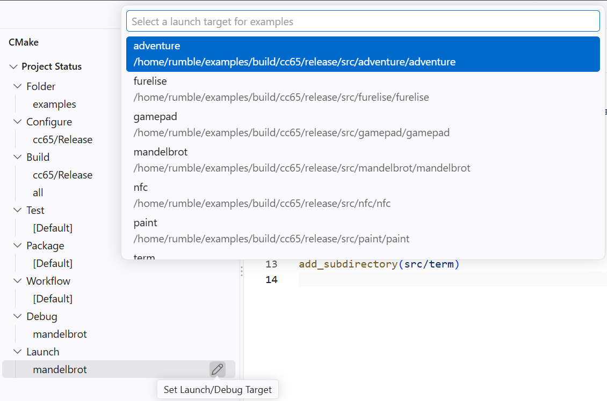
         the project's ROMs.

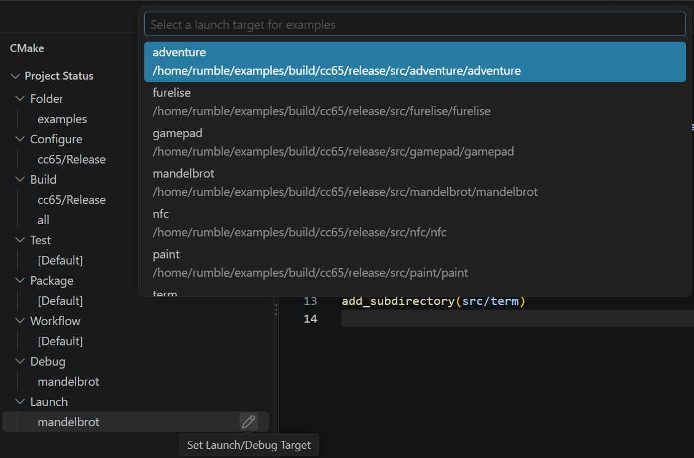
         the project's ROMs.

``rp6502_map()`` takes the target, so ``hello`` and ``setup`` can have
different XRAM layouts. Each ROM is built only after the checks pass for
every header mapped for it.

A larger project can give each ROM a directory of its own, as the
`examples <https://github.com/picocomputer/examples>`__ do:

.. code-block:: cmake

  # CMakeLists.txt
  add_subdirectory(src/hello)
  add_subdirectory(src/setup)

  # src/setup/CMakeLists.txt
  add_executable(setup)
  rp6502_map(setup xram.h "XRAM_.*")
  rp6502_asset(setup help setup.hlp)
  rp6502_executable(setup DATA default RESET default)
  target_sources(setup PRIVATE setup.c)

Each ROM is written to the matching folder of the build, such as
``build/cc65/debug/src/setup/setup.rp6502``.

Command Line
============

The sections above use VS Code. This section covers building and running
without it: on a build server,
in another editor, or with a 6502 program from another toolchain.

Building
--------

Each CMake preset is a compiler and a build type. These commands list the
presets, then configure and build ``cc65/Debug``, the same as choosing
that preset in VS Code.

.. code-block:: text

  cmake --list-presets
  cmake --preset cc65/Debug
  cmake --build --preset cc65/Debug

The ROM is ``build/cc65/debug/hello.rp6502``. The configure step
downloads the emulator when ``tools/`` has none, so the first configure
of a fresh clone needs a network connection.

Running on Hardware
-------------------

``rp6502.py run`` copies the ROM to the current folder of the monitor, or
to the ``workdir`` folder, loads it, and opens a terminal on the console.
In the terminal, Ctrl-A then X exits, and Ctrl-A then B sends a break.
Options go before the subcommand, and ``-c .rp6502`` uses the settings
file that VS Code uses.

.. code-block:: text

  python3 tools/rp6502.py -c .rp6502 run build/cc65/debug/hello.rp6502

Without a settings file, name the serial port with ``-d``, or the host
and passkey for telnet with ``-d`` and ``-k``. With ``-c``, the settings
in the file take precedence over these options.

.. code-block:: text

  python3 tools/rp6502.py -d /dev/ttyUSB0 run build/cc65/debug/hello.rp6502
  python3 tools/rp6502.py -d 192.168.1.20 -k secret run build/cc65/debug/hello.rp6502

Words after the ROM's file name are passed to the ROM as its arguments.
``rp6502.py`` has these subcommands, and ``python3 tools/rp6502.py
--help`` lists every option.

.. list-table::
   :widths: 20 80
   :header-rows: 1

   * - Subcommand
     - Description
   * - ``run``
     - Copy a ROM to the USB drive, load it, and open a terminal.
   * - ``upload``
     - Copy files to the USB drive. With one file, ``-o`` sets the name
       it is saved under.
   * - ``term``
     - Open a terminal on the console.
   * - ``basic``
     - Type a BASIC program into the BASIC installed on the Picocomputer,
       and run it.
   * - ``execute``
     - Run a ROM in the emulator. See `Running in the Emulator`_.
   * - ``emu``
     - Start the emulator as the debugger for an editor. VS Code uses
       this.
   * - ``create``
     - Package files into a ROM. See `Packaging a ROM by Hand`_.

``run``, ``upload``, ``term`` and ``basic`` send a break first, which
stops the program running on the Picocomputer.

Running in the Emulator
-----------------------

To run a ROM in a window, pass it to the emulator, ``rp6502-emu.exe`` on
Windows and WSL:

.. code-block:: text

  tools/rp6502-emu build/cc65/debug/hello.rp6502

``rp6502.py execute`` runs a ROM in the emulator with no window and no
speed limit. The ROM's output goes to standard output. Its standard input
is empty, so a read returns end of file. The ROM's exit code becomes the
command's exit code, so a ROM can run as a step in a script or a test.

.. code-block:: text

  python3 tools/rp6502.py -c .rp6502 execute build/cc65/debug/hello.rp6502

Another editor can debug with the emulator through the :ref:`Debug
Adapter Protocol <emu-dap>`.

Packaging a ROM by Hand
-----------------------

``rp6502.py create`` packages files into a ROM, and
``rp6502_executable()`` uses it to build every ROM. Use it directly when
the 6502 program comes from a tool CMake doesn't run, such as an
assembler that writes a linked binary. The options it takes are:

- ``-a``: the address to load the first file at, or the name of an asset;
- ``-r``: the reset address, and ``-i`` and ``-n`` for IRQ and NMI;
- ``-o``: the ROM file to write.

The first file is the data to package. Every file after it must already
be a ROM, and its contents are merged in. A ROM that holds only named
assets is an input for merging and can't be run, because it has no reset
address.

This example packages an assembler's binary that loads at ``$0400``,
with a help file, a data file, and an image loaded into XRAM.

.. code-block:: text

  # The help text, as a named asset.
  python3 tools/rp6502.py -a help -o help.rp6502 create plvm.help

  # A data file the program opens as ROM:level1.
  python3 tools/rp6502.py -a level1 -o level1.rp6502 create level1.dat

  # An image loaded into XRAM before the 6502 starts.
  python3 tools/rp6502.py -a 0x10000 -o splash.rp6502 create splash.bin

  # The program at $0400 with a reset address, merged with the rest.
  python3 tools/rp6502.py -a 0x0400 -r 0x0400 -o plvm.rp6502 \
      create plvm.bin help.rp6502 level1.rp6502 splash.rp6502

The result is ``plvm.rp6502``. It holds memory chunks for the program at
``$0400``, the reset vector at ``$FFFC``, and the image at ``$10000``. It
also holds two named assets, ``help`` and ``level1``.

.. _sdk-rom-file-format:

ROM File Format
===============

A ROM file is a shebang line, then one group of memory chunks, then any
number of named assets. Header lines are text and end with ``\n`` or
``\r\n``. Numbers may be written in decimal (255), C-style hex (0xFF) or
MOS-style hex ($FF). This is ``hello.rp6502`` from the template, with the
binary data left out:

.. code-block:: text

  #!RP6502                         shebang
  #>$000003AC $FB52BEE0            memory chunks, 0x3AC bytes follow
  $0200 $37E $07A747B2             chunk: 0x37E bytes of program
  $FFFC $002 $AFD773D3             chunk: 2 bytes, the reset vector
  #>$0000006E $E047820E help       named asset: 0x6E bytes of help text

**Shebang** — the first line of every ROM file. The tools write:

.. code-block:: text

  #!RP6502

Any first line that starts with ``#!`` and contains ``rp6502``, in upper
or lower case, is accepted. The first line can therefore name the program
that runs the ROM. A ROM file marked executable then runs from a shell
when that program is on the PATH:

.. code-block:: text

  #!/usr/bin/env rp6502-emu

**Memory chunks** — the line after the shebang starts the group of memory
chunks, which are loaded into RAM or XRAM before the 6502 starts:

.. code-block:: text

  #>len crc

``len`` is the number of bytes that follow in the group, counting each
chunk's header line as well as its data, and ``crc`` is the CRC-32 of
those bytes. Each chunk is a header line followed by its data:

.. code-block:: text

  addr len crc

.. list-table::
   :widths: 1 20
   :header-rows: 1

   * - Field
     - Description
   * - ``addr``
     - Destination address in RAM (``$0000-$FEFF``), the 6502 vectors
       (``$FFFA-$FFFF``), or XRAM (``$10000-$1FFFF``). A ROM must set
       the reset vector at ``$FFFC-$FFFD`` to be loaded.
   * - ``len``
     - Number of bytes of binary data that follow this line. At most
       1024, and a chunk may not cross a 64 KB boundary.
   * - ``crc``
     - CRC-32 of the binary data.

**Named asset** — a file the program opens by name while it runs:

.. code-block:: text

  #>len crc name

The line is followed by ``len`` bytes of binary data. Named assets repeat
to the end of the file.

.. list-table::
   :widths: 1 20
   :header-rows: 1

   * - Field
     - Description
   * - ``len``
     - Number of bytes of binary data that follow this line.
   * - ``crc``
     - CRC-32 of the binary data.
   * - ``name``
     - The asset's name.

The CRC is CRC-32 as zlib and PNG compute it. The format sets no limit on
the number or size of named assets. Opening ``ROM:`` plus a name reads
each asset header in file order and skips its data, so a ROM with many
assets takes longer to open the last ones.
