============================
RP6502-SDK
============================

RP6502 - Software Development Kit

Introduction
============

Picocomputer software is distributed as a ROM: one file ending in
``.rp6502``, such as ``game.rp6502``. A ROM describes the state of the
machine as it comes out of reset, and that state is the same every time:
the program and data are in memory, and the reset vector points to where
the program begins. A single ROM can hold every piece of code, video and
audio your game needs.

If this sounds a lot like the cartridge ROM of a game console, or the
BASIC ROM in your 8-bit home computer, that's not a coincidence.

The SDK builds a ROM, runs it with the :doc:`emu`, an :doc:`pico` or the
:doc:`web`, and debugs it in the :doc:`emu` while it runs. A project
starts as a copy of the `RP6502 project template
<https://github.com/picocomputer/rp6502-sdk>`__, which builds with
either of two 6502 compilers, cc65 or llvm-mos. The template
includes the same "Hello, world!" program four times: in C, which builds
with either compiler; in the assembly syntax of each compiler; and in
BASIC.

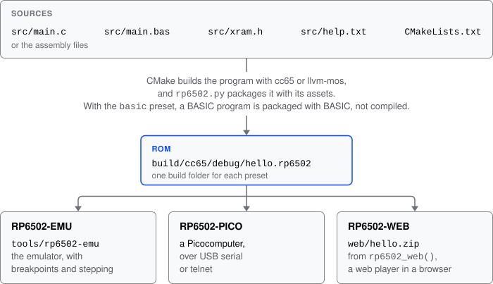
         src/xram.h, src/help.txt and CMakeLists.txt. CMake builds the
         program with cc65 or llvm-mos, and rp6502.py packages it with
         its assets into the ROM, such as build/cc65/debug/hello.rp6502,
         in the build folder of the preset. With the basic preset, a
         BASIC program is packaged with BASIC. The ROM is run with
         RP6502-EMU, the emulator in tools/ with breakpoints and stepping;
         RP6502-PICO, a standalone machine over USB serial or telnet; or
         RP6502-WEB, web/hello.zip from rp6502_web(), a web player in a
         browser.

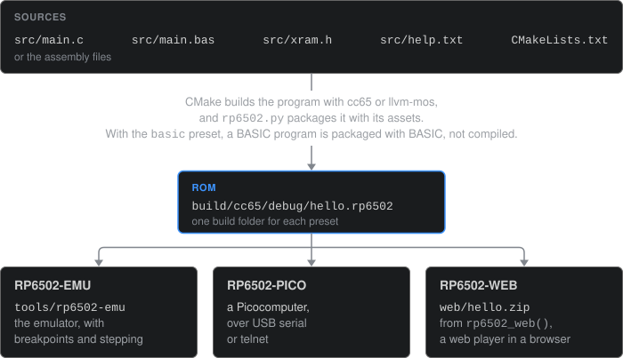
         src/xram.h, src/help.txt and CMakeLists.txt. CMake builds the
         program with cc65 or llvm-mos, and rp6502.py packages it with
         its assets into the ROM, such as build/cc65/debug/hello.rp6502,
         in the build folder of the preset. With the basic preset, a
         BASIC program is packaged with BASIC. The ROM is run with
         RP6502-EMU, the emulator in tools/ with breakpoints and stepping;
         RP6502-PICO, a standalone machine over USB serial or telnet; or
         RP6502-WEB, web/hello.zip from rp6502_web(), a web player in a
         browser.

.. _sdk-install:

Installing the Tools
====================

Building Picocomputer software takes VS Code, CMake 3.21 or later,
Python 3, git, Make or Ninja, and one or both of the 6502 compilers, cc65
and llvm-mos. Only the compilers have to be recent. New Picocomputer
features are often added to cc65 and llvm-mos before their next release,
and the versions in package managers such as apt and Homebrew are too old.

Each compiler is installed with one command. The command downloads the
best build at the moment, from the upstream project or from the
Picocomputer fork of it. Which one is used, and why, is shown on the
`Picocomputer GitHub page <https://github.com/picocomputer?view_as=public>`__. The
compiler goes in the ``.rp6502`` folder in your home folder, and its
``bin`` folder is added to PATH, the list of folders where programs are
looked up. Running the same command again updates the compiler, and it
also switches between upstream and the fork when the recommendation on the
GitHub page changes. These compilers have a changed ``rp6502.h``, so a
project written for an older one may need the changes in `Updating an
Older Project`_.

Windows
-------

Open PowerShell and install the tools with winget:

.. code-block:: powershell

   winget install -e --id Git.Git
   winget install -e --id Kitware.CMake
   winget install -e --id Ninja-build.Ninja
   winget install -e --id Microsoft.VisualStudioCode
   winget install -e --id Python.PythonInstallManager

Close PowerShell and open it again, so the new PATH takes effect. Then
install Python, make Ninja the build tool, and install the compilers:

.. code-block:: powershell

   py install default
   setx CMAKE_GENERATOR Ninja
   irm https://raw.githubusercontent.com/picocomputer/.github/main/install/cc65.ps1 | iex
   irm https://raw.githubusercontent.com/picocomputer/.github/main/install/llvm-mos.ps1 | iex

Windows has no Make, so ``CMAKE_GENERATOR`` makes Ninja the build tool of
every CMake project that names no generator. Close every PowerShell and VS
Code window before going on. For a project configured before this step,
run "CMake: Delete Cache and Reconfigure" from the VS Code Command Palette.

In WSL, follow the Linux steps instead.

macOS
-----

Open Terminal and install Apple's command line tools, which include git,
Make and Python 3:

.. code-block:: sh

   xcode-select --install

.. SCREENSHOT: _static/sdk/macos-clt-light.png and macos-clt-dark.png,
   the dialog that xcode-select opens, with its Install button.

Download the macOS universal disk image of `CMake
<https://cmake.org/download/>`__, drag CMake to Applications, and add its
command-line tools:

.. code-block:: sh

   sudo "/Applications/CMake.app/Contents/bin/cmake-gui" --install

Download `VS Code <https://code.visualstudio.com/download>`__ and drag it
to Applications. Then install the compilers:

.. code-block:: sh

   curl -fsSL https://raw.githubusercontent.com/picocomputer/.github/main/install/cc65.sh | sh
   curl -fsSL https://raw.githubusercontent.com/picocomputer/.github/main/install/llvm-mos.sh | sh

Quit VS Code with Cmd+Q and open it again, because VS Code reads PATH
only when it starts.

Linux
-----

On Ubuntu and Debian, install the tools with apt. Ubuntu 22.04 and Debian
12 and their later releases have CMake 3.21 or later.

.. code-block:: sh

   sudo apt install git cmake build-essential python3

Download the ``.deb`` of `VS Code <https://code.visualstudio.com/download>`__,
and install it from the folder it was saved in:

.. code-block:: sh

   sudo apt install ./code_*.deb

Give your account access to the USB serial port of an RP6502-PICO, and
install the compilers:

.. code-block:: sh

   sudo usermod -a -G dialout $USER
   curl -fsSL https://raw.githubusercontent.com/picocomputer/.github/main/install/cc65.sh | sh
   curl -fsSL https://raw.githubusercontent.com/picocomputer/.github/main/install/llvm-mos.sh | sh

Restart your session, so the new group and PATH take effect. Other
distributions have the same tools under other package names. On Arch,
the serial port group is ``uucp`` instead of ``dialout``.

Getting Started
===============

Install the tools first. The steps are in `Installing the Tools`_.

**1. Make a project.** On the template's GitHub page, select "Use this
template", then "Create a new repository". GitHub creates a new repository
with a copy of the template. Clone it and open the folder in VS Code.

**2. Install the recommended extensions** when VS Code prompts for them:

- the C/C++ Extension Pack, which includes CMake Tools, to build;
- LLDB DAP, to debug in the emulator;
- Python Debugger, to run ``tools/rp6502.py``.

**3. Choose a configure preset.** The first time the project opens,
CMake Tools lists five presets. Four are for C, one for each combination
of compiler and build type. Choose a Debug preset, because breakpoints
and stepping require debug information. Release is the optimized build
for a ROM you share. The fifth, ``basic``, is for BASIC: choose it, and
write the program in ``src/main.bas``. The preset can be changed later
from the Configure row of the CMake side panel.

.. SCREENSHOT: preset-*.png show four presets. Retake them with all
   five: cc65/Debug, cc65/Release, llvm-mos/Debug, llvm-mos/Release and
   basic.

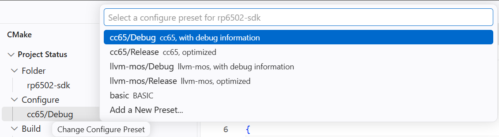
         cc65/Release, llvm-mos/Debug, llvm-mos/Release and basic, above
         the CMake side panel's Configure row.

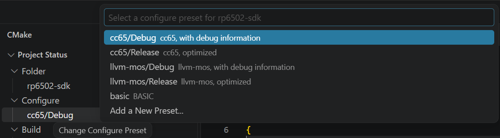
         cc65/Release, llvm-mos/Debug, llvm-mos/Release and basic, above
         the CMake side panel's Configure row.

The first configure downloads the tools into ``tools/``: the CMake
functions, ``rp6502.py``, and the emulator for your system.

**4. Press F5 to debug.** VS Code builds ``hello.rp6502`` and runs it in
the emulator. "Hello, world!" appears on the emulator's screen and in VS
Code's Debug Console. The session stays open after the program ends so
the screen can be read. Stop it with Shift+F5. The emulator window may
open behind VS Code.

.. SCREENSHOT: first-run-*.png show RP6502 (Emulator) in the status bar.
   Retake them with the entry named RP6502-EMU.

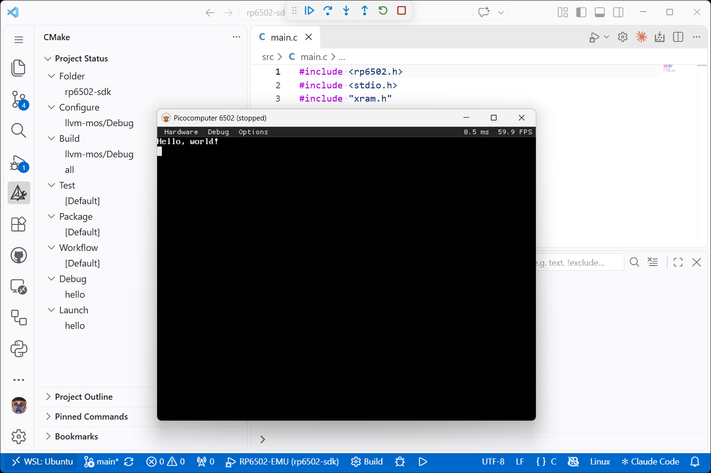
         with its debug toolbar.

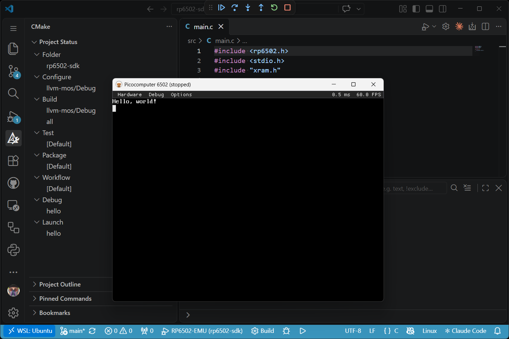
         with its debug toolbar.

The project now looks like this:

.. code-block:: text

   my-project/
   ├── CMakeLists.txt         the ROMs this project builds
   ├── CMakePresets.json      the five configure presets
   ├── README.md              web player link, requirements, updating
   ├── .github/               GitHub Pages workflows
   ├── .vscode/               F5 configurations, tasks, extensions
   ├── src/
   │   ├── main.c             Hello, world! in C
   │   ├── main-cc65.s        the same in cc65 assembly
   │   ├── main-llvm-mos.s    the same in llvm-mos assembly
   │   ├── main.bas           the same in BASIC
   │   ├── xram.h             the XRAM layout
   │   └── help.txt           the help asset
   ├── tools/                 commit these
   │   ├── rp6502.cmake
   │   ├── rp6502.py
   │   ├── cc65-toolchain.cmake
   │   ├── cc65-config.cmake
   │   └── rp6502-emu         the emulator, ignored by git
   ├── build/                 build output, ignored by git
   └── .rp6502                the settings file, ignored by git

On Windows and WSL, the emulator is ``rp6502-emu.exe``. The web player
linked in ``README.md`` is published to GitHub Pages by
``.github/workflows/web.yml``, as described in :ref:`GitHub Pages
<web-github>`.

To choose C, assembly or BASIC for the project, edit ``CMakeLists.txt``.
Its ``if(RP6502_BASIC)`` has a branch for BASIC and a branch for C. Keep
the branch you want, and delete the other branch and the ``if()``. For
assembly, keep the C branch and replace ``src/main.c`` in it with
``src/main-cc65.s`` or ``src/main-llvm-mos.s``.

Then delete the presets and source files you do not use. In
``README.md``, set ``preset:`` in the ``<!-- rp6502`` comment to a preset
you keep.

Commit the ``tools/`` folder, so every clone of the project builds with
the same tools. The tools change only when you update them, with the
"RP6502: update tools" task (Terminal > Run Task) or with
``cmake -P tools/rp6502.cmake``. An update replaces each tool file with
the latest version from the rp6502 repository, and local changes to those
files are lost. An update also downloads the latest emulator release. On
Windows, close the emulator before updating.

When ``tools/`` has no emulator, the next configure downloads one, so a
fresh clone needs no extra step. If the release has no emulator for your
system, the configure writes ``tools/rp6502-emu.unsupported``, which
names the missing build. Later configures don't try again until the next
update. Build the emulator from the `rp6502 repository
<https://github.com/picocomputer/rp6502>`__, then set ``emulator`` in
`The .rp6502 Settings File`_ to its path.

Running and Debugging
=====================

"Start Debugging" (F5) runs one of three launch configurations. Choose
which in the Run and Debug side panel.

.. SCREENSHOT: configs-*.png show RP6502 (Emulator) and RP6502
   (Hardware) only. Retake them with RP6502-EMU, RP6502-PICO and
   RP6502-WEB.

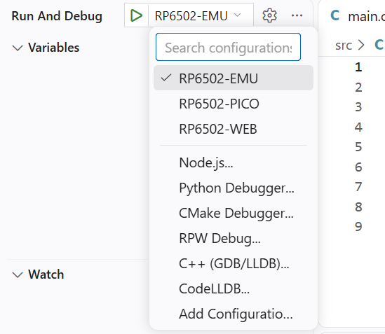
         RP6502-PICO and RP6502-WEB.

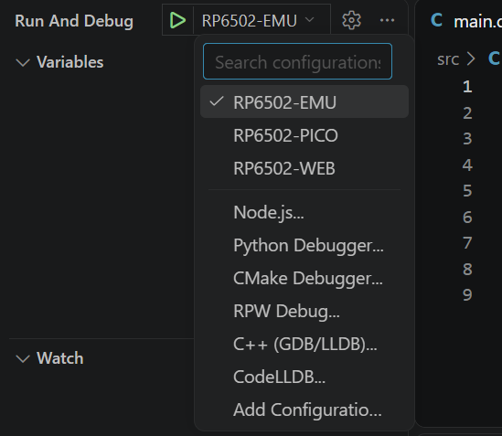
         RP6502-PICO and RP6502-WEB.

**RP6502-EMU** is the default. It builds the project and runs it
in the :doc:`emu` with source-level debugging: breakpoints, stepping, the
call stack, variables and watch expressions, all of which need a Debug
preset. With llvm-mos, variables show their C types, and structures and
arrays expand. With cc65, variables have no types, and each variable's
size comes from where its symbol sits in memory.
:ref:`Debugging <emu-debugging>` in the emulator's datasheet covers both.

.. SCREENSHOT: breakpoint-*.png show RP6502 (Emulator) in the status bar
   and the Run and Debug header. Retake them with the entry named
   RP6502-EMU.

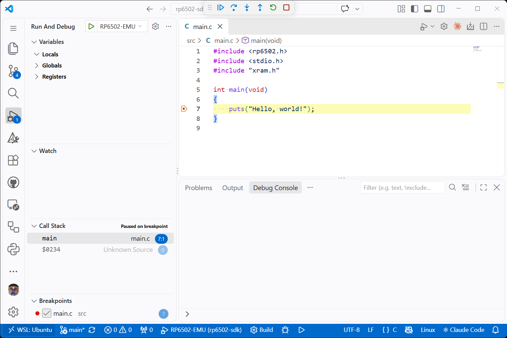
         Call Stack panels.

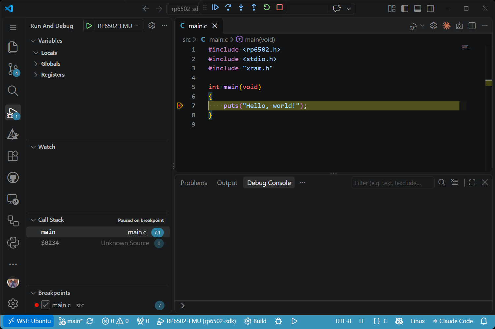
         Call Stack panels.

**RP6502-PICO** builds the project and runs it on an :doc:`pico`.
The connection is USB, through the USB port on the VGA module, or telnet
with an :doc:`ria_w`. First set ``device``, and ``key`` for telnet, as
`The .rp6502 Settings File`_ describes.

The ROM is copied to the current drive and folder of the monitor, the
command prompt of the RP6502-PICO, or to the ``workdir`` folder when the
settings file sets one. It is loaded from there, so a USB drive must be
plugged in. The copy replaces any file with the same name. The program's
console opens in a VS Code terminal. There are no breakpoints or stepping
on the RP6502-PICO. In the terminal, Ctrl-A then X exits, and Ctrl-A then
B sends a break. A break stops the program and returns to the monitor.

**RP6502-WEB** builds the project and opens a page in a browser with a
link to every web player that ``rp6502_web()`` makes, as `Web Players`_
describes.

All three configurations work with the ``basic`` preset as well. The
source-level debugging of RP6502-EMU applies to C and assembly only:
breakpoints, stepping and variables are not available for the lines of a
BASIC program.

The .rp6502 Settings File
=========================

The settings file is named ``.rp6502`` and is in the project folder. It is
not a ROM, although it has the same extension. It is created the first
time the tools run. To run on an RP6502-PICO, set ``device`` in the
``[RP6502][Launch]`` section, and ``key`` as well for telnet.

.. code-block:: text

  [RP6502][Launch]
  emulator = tools/rp6502-emu
  device = /dev/ttyACM0
  key =
  workdir =
  args =
  term = True

.. list-table::
   :widths: 20 80
   :header-rows: 1

   * - Setting
     - Description
   * - ``emulator``
     - Path to the emulator: ``tools/rp6502-emu``, or
       ``tools/rp6502-emu.exe`` on Windows and WSL. A relative path is
       resolved against the settings file's folder. A bare name that isn't
       there, such as ``rp6502-emu``, is looked up on the PATH.
   * - ``device``
     - The serial port of the RP6502-PICO. A new settings file sets it to
       the usual port for your system: ``/dev/ttyACM0`` on Linux, the
       first ``/dev/cu.usbmodem`` device on macOS, or ``COM1`` on Windows.
       On Windows the RP6502-PICO is usually on a higher COM number, shown
       in Device Manager. When ``key`` is set, ``device`` is the hostname
       or IP address of the RP6502-PICO for telnet, with an optional
       ``:port`` (23 by default).
   * - ``key``
     - Passkey for telnet. Leave it empty to use a serial port. See
       :ref:`Telnet Console <ria-w-telnet-console>`.
   * - ``workdir``
     - Folder at the root of the current drive of the monitor where the
       ROM is copied, such as ``MyGame``. Leave it empty to copy the ROM to
       the current folder of the monitor.
   * - ``args``
     - Arguments for the ROM. The program receives them only when it
       defines ``__argv_mem()``, as :ref:`ARGV <api-argv>` describes.
   * - ``term``
     - Open a terminal on the console when running on an RP6502-PICO.

The emulator also saves its debugger window layout in this file, so each
project reopens with its windows where you left them.

Building a ROM
==============

``CMakeLists.txt`` describes the ROMs a project builds. This listing is
the C branch of the template's ``CMakeLists.txt``, without the ``if()``.
BASIC projects are described in `BASIC Programs`_.

.. code-block:: cmake

  cmake_minimum_required(VERSION 3.21)

  include(${CMAKE_CURRENT_LIST_DIR}/tools/rp6502.cmake)

  project(MY-RP6502-PROJECT C CXX ASM)

  add_executable(hello)
  rp6502_map(hello src/xram.h "XRAM_.*")
  rp6502_asset(hello help src/help.txt)
  rp6502_executable(hello DATA default RESET default)
  rp6502_web(hello)
  target_sources(hello PRIVATE
      src/main.c
  )

- ``include()`` loads the RP6502 CMake functions from ``tools/``.
- ``add_executable(hello)`` creates the program, a CMake target named
  ``hello``.
- ``rp6502_map()`` reads the XRAM addresses for ``hello`` from
  ``src/xram.h``. See `Addresses in CMake`_.
- ``rp6502_asset()`` adds an asset to the ROM. See `Adding Assets`_.
- ``rp6502_executable()`` packages the program and its assets into
  ``hello.rp6502``, named after the target.
- ``rp6502_web()`` packages the ROM into a web player. See `Web Players`_.
- ``target_sources()`` lists the program's source files.

``rp6502_map()`` and every ``rp6502_asset()`` come after
``add_executable()`` and before ``rp6502_executable()``. ``rp6502_map()``
also comes before any ``rp6502_asset()`` that uses its names.
``rp6502_web()`` comes after ``rp6502_executable()``, because it packages
the ROM that ``rp6502_executable()`` defines.
``target_sources()`` can go anywhere after ``add_executable()``.

The ROM is written to the preset's build folder:
``build/<compiler>/<debug or release>/``, or ``build/basic/`` for the
``basic`` preset. The cc65 Debug build is ``build/cc65/debug/hello.rp6502``.
To share a program, build it with a Release preset, or the ``basic`` preset
for BASIC, and share that file, or its web player as described in
:doc:`web`.

``rp6502_executable()`` takes these keywords:

.. list-table::
   :widths: 20 80
   :header-rows: 1

   * - Keyword
     - Description
   * - ``DATA``
     - The address the program loads at. Without ``DATA``, the program is
       left out, and the ROM holds only its assets.
   * - ``RESET``
     - The address the 6502 starts running at, stored at
       ``$FFFC-$FFFD``. Required.
   * - ``IRQ``
     - The address of the interrupt handler, stored at ``$FFFE-$FFFF``.
       Optional.
   * - ``NMI``
     - The address of the non-maskable interrupt handler, stored at
       ``$FFFA-$FFFB``. Optional.

Each keyword takes a number, such as ``0x200``, or one of two words:

- ``file`` takes the address from the start of the linker output. Only
  llvm-mos writes addresses there: the load address, then the start
  address.
- ``default`` is ``0x200`` with cc65 and ``file`` with llvm-mos.

Use ``file`` and ``default`` only with ``DATA`` and ``RESET``. Give
``IRQ`` and ``NMI`` a number.

.. _sdk-assets:

Adding Assets
=============

Graphics, level data, help text and any other files the program uses are
packaged into the same ``.rp6502`` file with ``rp6502_asset()``. BASIC
programs are assets as well, as described in `BASIC Programs`_.

.. code-block:: cmake
  :force:

  rp6502_asset(hello RAM(0x00F0) bin/f0.bin)
  rp6502_asset(hello XRAM(0x1000) img/tiles.bin)
  rp6502_asset(hello help src/help.txt)

An asset with an address in ``RAM()`` or ``XRAM()`` is a memory chunk.
Before the 6502 starts, the file is loaded to that address in RAM, or in
XRAM, the 64 KB of extended memory outside the 6502's address space
described in `XRAM Memory Map`_. ``XRAM()`` takes the address the program
uses, and the bit that marks the address as XRAM is set automatically.
Inside the parentheses, the address is a number, the name of a CMake
variable, or a name read by ``rp6502_map()`` (see `Addresses in CMake`_).

Any other address is a name, and a named asset is a file the program opens
while it runs. Prefix the name with ``ROM:`` and open it like any other
file. Named assets are read-only, and several can be open at once. To
load one into XRAM, pass its file descriptor to
:ref:`read_xram() <api-read-xram>`.

.. code-block:: C

  open("ROM:help", O_RDONLY);

The asset named ``help`` is the ROM's help text. An :doc:`pico` monitor
shows it with the HELP and INFO commands, and the emulator shows it in the
ROM Help window. The template's help text is ``src/help.txt``.

An asset can also be made by the build, such as an image converted from a
PNG. Create it with ``add_custom_command()`` and pass its output file to
``rp6502_asset()``. Both calls must be in the same ``CMakeLists.txt``,
because CMake connects a generated file to the step that uses it only
within one directory. The paint program in the `examples
<https://github.com/picocomputer/examples>`__ does this.

.. code-block:: cmake

  find_package(Python3 REQUIRED COMPONENTS Interpreter)
  add_custom_command(
      OUTPUT ${CMAKE_CURRENT_BINARY_DIR}/logo.bin
      COMMAND ${Python3_EXECUTABLE}
          ${CMAKE_CURRENT_SOURCE_DIR}/png2bin.py
          ${CMAKE_CURRENT_SOURCE_DIR}/logo.png
          ${CMAKE_CURRENT_BINARY_DIR}/logo.bin
      DEPENDS png2bin.py logo.png
      VERBATIM
  )
  rp6502_asset(hello logo ${CMAKE_CURRENT_BINARY_DIR}/logo.bin)

The build fails if two memory chunks overlap ("ROM data already exists")
or two assets have the same name ("Asset name already exists").

.. _sdk-memory-map:

Memory Map
==========

Everything below $FF00 is RAM, and nothing in zero page is used or
reserved. The Picocomputer starts every project as a clean slate. VGA,
audio, storage, keyboards, mice, gamepads, the RTC, and networking are
all reached through just the 32 registers of the RIA (the RP6502
Interface Adapter).

.. list-table::
   :widths: 25 75
   :header-rows: 1

   * - Address
     - Description
   * - $0000-$FEFF
     - RAM, 63.75 KB
   * - $FF00-$FFCF
     - Unassigned
   * - $FFD0-$FFDF
     - VIA, see the `WDC datasheet
       <https://www.westerndesigncenter.com/wdc/w65c22-chip.php>`_
   * - $FFE0-$FFFF
     - RIA, see the :doc:`RP6502-RIA datasheet <ria>`
   * - $10000-$1FFFF
     - XRAM, 64 KB, see `XRAM Memory Map`_

The unassigned space is open for experimenters. Design your own
chip-select logic to use it.

Each compiler includes a linker script that lays out zero page and the
rest of RAM, so a project does not have to manage the layout.

Most projects keep the default layout. For a different one, copy the
compiler's script into the project, change the copy, and pass it to the
linker with ``target_link_options()``. The scripts are ``cfg/rp6502.cfg``
in the cc65 folder and ``mos-platform/rp6502/lib/link.ld`` in the
llvm-mos folder. With cc65, a script that moves the start of RAM needs
``DATA`` and ``RESET`` given as numbers, because ``default`` is always
``0x200``.

.. code-block:: cmake

  # cc65:
  target_link_options(hello PRIVATE -C ${CMAKE_SOURCE_DIR}/src/hello.cfg)
  # llvm-mos:
  target_link_options(hello PRIVATE -T ${CMAKE_SOURCE_DIR}/src/hello.ld)

The `ld65 documentation <https://cc65.github.io/doc/ld65.html>`__
describes the cc65 script format, and the llvm-mos wiki page `Linker Script
<https://llvm-mos.org/wiki/Linker_Script>`__ describes the llvm-mos format.

.. _sdk-xram-memory-map:

XRAM Memory Map
===============

XRAM is 64 KB of memory outside the 6502's address space. The preferred
way to read and write it from C is with the XRAM functions of the
:doc:`api`, such as :c:func:`xram0_read`, :c:func:`xram0_write` and
:c:func:`xram0_peek8`. The 0 or 1 in a name selects which of the two
:ref:`XRAM portals <ria-xram-portals>` of the RIA the call uses, and the
two portals can point to different addresses.

XRAM holds the data for the virtual devices: keyboard, mouse, tablet and
gamepad input, the PSG and OPL2 sound generators, VGA mode configurations,
and the pixels, tiles and sprites the modes draw. XRAM has no fixed map.
You choose an address for each device's data, and set it in the device's
extended register (XREG) with :ref:`xreg() <api-xreg>`.

A ROM's map is usually kept in one file, ``xram.h`` for C or ``xram.inc``
for assembly. It holds the structure of each device the program uses, and a
layout that places them in XRAM with a name for each address. Add a
device's structure when the program starts using the device, and
rearrange the layout as the data grows. The template's ``src/xram.h`` is
this file, with a placeholder structure, ``xram_feature_t``, to replace.

The structures are in the :doc:`ria` and :doc:`vga` datasheets. Each one is
in a code block labeled ``xram.h`` or ``xram.inc``, together with its
constants and XREG macros. Choose the C, ca65 or llvm-mc tab, then use the
"Copy to clipboard" button in the corner of the block to copy the whole
block into ``xram.h`` or ``xram.inc``.

The structures are not part of ``rp6502.h`` or ``rp6502.inc``. The copy
in ``xram.h`` is the only definition the program uses. This approach is
unusual, but the project depends on no submodule or shared header for
these structures, so changes to the SDK do not break its build, and the
whole map is in one file. Register numbers, field offsets and sizes never
change. Only names can change in the docs, and a name in the copy can be
changed without affecting anything else.

This example is for a program that uses only the keyboard. The keyboard
definitions are the :ref:`Keyboard <ria-keyboard>` block from the
:doc:`ria` datasheet, and the layout after them places the keyboard at
address 0. The types marked ``/* layout */`` are the blocks a program
places in ``xram_layout_t`` and gives to an XREG.

.. tab:: C

   .. code-block:: C
      :caption: xram.h

      #ifndef XRAM_H
      #define XRAM_H

      #include <rp6502.h>
      #include <stdbool.h>
      #include <stddef.h>
      #include <stdint.h>

      #define KEYBOARD_NO_KEY 0
      #define KEYBOARD_NUM_LOCK 1
      #define KEYBOARD_CAPS_LOCK 2
      #define KEYBOARD_SCROLL_LOCK 3

      #define KEYBOARD_PRESSED(keys, code) ((keys)[(code) >> 3] & (1 << ((code) & 7)))

      #define xreg_ria_keyboard(...) xreg(0, 0, 0, __VA_ARGS__)

      typedef struct
      {
          uint8_t keys[32];
      } keyboard_t; /* layout */

      typedef struct
      {
          keyboard_t keyboard;
      } xram_layout_t;

      #define XRAM_KEYBOARD offsetof(xram_layout_t, keyboard)

      #endif

.. tab:: ca65

   .. code-block:: ca65
      :caption: xram.inc

      .ifndef XRAM_INC
      XRAM_INC = 1

      KEYBOARD_NO_KEY      = 0
      KEYBOARD_NUM_LOCK    = 1
      KEYBOARD_CAPS_LOCK   = 2
      KEYBOARD_SCROLL_LOCK = 3

      .macro xreg_ria_keyboard addr
          xreg 0, 0, 0, addr
      .endmacro

      .struct keyboard_t
          keys .res 32
      .endstruct

      .struct xram_layout_t
          keyboard .tag keyboard_t
      .endstruct

      XRAM_KEYBOARD = xram_layout_t::keyboard

      .endif

.. tab:: llvm-mc

   .. code-block:: ca65
      :caption: xram.inc
      :force:

      .ifndef XRAM_INC
      XRAM_INC = 1

      KEYBOARD_NO_KEY      = 0
      KEYBOARD_NUM_LOCK    = 1
      KEYBOARD_CAPS_LOCK   = 2
      KEYBOARD_SCROLL_LOCK = 3

      .macro xreg_ria_keyboard addr
          xreg 0, 0, 0, \addr
      .endm

      KEYBOARD_KEYS = 0
      KEYBOARD_SIZE = 32

      XRAM_KEYBOARD = 0

      .endif

Each ``XRAM_`` name is the address of one part of the layout, and the
program uses these names for every XRAM address. This code maps the
keyboard to its address, then loops until a key is pressed.

.. tab:: C
   :new-set:

   .. code-block:: C

      xreg_ria_keyboard(XRAM_KEYBOARD);
      while (xram0_peek8(XRAM_KEYBOARD) & (1 << KEYBOARD_NO_KEY))
          ;

.. tab:: ca65

   .. code-block:: ca65

          xreg_ria_keyboard XRAM_KEYBOARD
          lda #<XRAM_KEYBOARD
          sta RIA_ADDR0
          lda #>XRAM_KEYBOARD
          sta RIA_ADDR0+1
          lda #0
          sta RIA_STEP0
      :   lda RIA_RW0
          and #1 << KEYBOARD_NO_KEY
          bne :-

.. tab:: llvm-mc

   .. code-block:: ca65
      :force:

          xreg_ria_keyboard XRAM_KEYBOARD
          lda #(XRAM_KEYBOARD & $FF)
          sta RIA_ADDR0
          lda #((XRAM_KEYBOARD >> 8) & $FF)
          sta RIA_ADDR0+1
          lda #0
          sta RIA_STEP0
      1:  lda RIA_RW0
          and #(1 << KEYBOARD_NO_KEY)
          bne 1b

Addresses in CMake
------------------

An asset that loads into XRAM needs its address in ``CMakeLists.txt`` as
well as in the header. This layout adds a 2 KB logo after the keyboard.
Only the changed part of ``xram.h`` is shown.

.. code-block:: C

  typedef struct
  {
      keyboard_t keyboard;
      uint8_t logo[2048];
  } xram_layout_t;

  #define XRAM_KEYBOARD offsetof(xram_layout_t, keyboard)
  #define XRAM_LOGO offsetof(xram_layout_t, logo)

``rp6502_map()`` reads the address names from the header, so each address
is written once, in the header, and never repeated in ``CMakeLists.txt``.

.. code-block:: cmake

  rp6502_map(<target> <header> <regex> [<unaligned_regex>])

.. code-block:: cmake
  :force:

  rp6502_map(hello src/xram.h "XRAM_.*")
  rp6502_asset(hello XRAM(XRAM_LOGO) img/logo.bin)

The regular expression selects which ``#define`` names to read, and must
match the whole name. The value can be any constant expression, including
one built from another name, such as
``#define XRAM_LOGO_ROW_2 (XRAM_LOGO + 64)``.

A define is skipped if it:

- is commented out;
- is inside an ``#if`` whose condition is false;
- has no value, such as an include guard;
- is a function-like macro.

The header can hold any other code the program uses.

A name works only inside ``RAM()`` and ``XRAM()``, in ``rp6502_asset()``
calls for the target named in ``rp6502_map()``. To read several headers
for one target, call ``rp6502_map()`` once for each. A name that two of
the headers define is a configure error.

``rp6502_map()`` compiles the header into a small program and runs it
in the emulator when CMake configures. Changing the header configures the
project again on the next build, so the addresses always match it. If the
header doesn't compile, or the emulator can't run, the build fails with
the reason. Every ``rp6502_asset()`` that uses one of the header's names
fails as well, so no ROM is written from an address that was not read.
The configure step still completes. Configure again once the problem is
fixed.

``rp6502_map()`` reads C headers only. For an assembly project, write the
address in ``RAM()`` or ``XRAM()`` as a number or as the name of a CMake
variable.

Alignment
---------

Neither compiler pads structures, so each member starts right after the
one before it. Mode configurations, palettes and the PSG are read as
16-bit values, so they need an even address. Every address is checked,
and an odd one fails the build with an error on the line of its
``#define``. With cc65 the error reads:

.. code-block:: text

  /home/me/hello/src/xram.h:34: error: static_assert failed 'XRAM_LOGO is
  unaligned. To allow, use the [<unaligned_regex>] in rp6502_map.'

Pixel data, fonts, tiles, sprite images, and the keyboard, mouse, gamepad
and tablet blocks work at any address. They are checked anyway, because
some hosts access them faster at an even address. To exempt names from
the check, pass a second regular expression:

.. code-block:: cmake

  rp6502_map(hello src/xram.h "XRAM_.*" "XRAM_LOGO")

The build also fails if the layout is larger than the 64 KB of XRAM, or
if an address does not fit in 16 bits.

Two requirements of the sound generators are not checked. The 64 bytes of
the PSG must not cross a page boundary, and the OPL2 registers must start
on one. A page is 256 bytes. To check them, copy the line for each sound
generator the program uses into ``xram.h``, after the ``XRAM_`` names:

.. code-block:: C

  _Static_assert(XRAM_PSG % 256 + sizeof(psg_t) <= 256, "XRAM_PSG crosses a page.");
  _Static_assert(XRAM_OPL % 256 == 0, "XRAM_OPL is not on a page boundary.");

The lines use the ``_Static_assert`` keyword because the ``assert.h`` of
llvm-mos has no ``static_assert`` macro.

The :doc:`fpga` has a 1 KB palette cache for paletted sprites, so it is
generally better to keep all sprite palettes within 1 KB. This matters
only near the performance limit; see :ref:`Sprite Limits
<vga-sprite-limits>` in the :doc:`vga` datasheet. To keep them within
1 KB, put the sprite palettes in a structure of their own, place it in
the layout, and check its size. Only the changed part of ``xram.h`` is
shown.

.. code-block:: C

  typedef struct
  {
      uint16_t player[16];
      uint16_t enemies[4][16];
  } palettes_t;

  typedef struct
  {
      keyboard_t keyboard;
      palettes_t palettes;
  } xram_layout_t;

  #define XRAM_KEYBOARD offsetof(xram_layout_t, keyboard)
  #define XRAM_PLAYER_PALETTE offsetof(xram_layout_t, palettes.player)
  #define XRAM_ENEMY_PALETTES offsetof(xram_layout_t, palettes.enemies)

  _Static_assert(sizeof(palettes_t) <= 1024, "palettes_t is larger than 1 KB.");

Multiple Compiler Artifacts
===========================

A cc65 program can load at more than one address, with one linker output
file for each, but CMake's ``add_executable()`` tracks only one output
file. ``rp6502_byproducts()`` declares the other files a target's build
writes. In a configuration for ld65, cc65's linker, each memory area with
a ``file`` of its own is a separate output file, and ``%O`` stands for
the output file name that CMake passes to the linker.

.. code-block:: cmake

  rp6502_byproducts(<target> <file>...)

Microsoft BASIC loads at three separate addresses: the ``CHRGET`` routine
at ``$00E8`` in zero page, the init code at ``$1000``, and the interpreter
at ``$C000``. Its linker configuration writes each one to its own file,
named after ``%O``.

.. code-block:: text

  MEMORY {
      ZP:       start = $0000, size = $00E7, file = "";
      CHRGETZP: start = $00E8, size = $0018, file = "%O.00E8";
      INITROM:  start = $1000, size = $8000, file = "%O.1000";
      BASROM:   start = $C000, size = $3DDE, file = "%O.C000";
      # areas with file = "" write nothing; trimmed here
      TOUCH:    start = $0000, size = $0000, file = %O;
  }

``TOUCH`` is an empty memory area whose file is ``%O``. The linker
writes it as an empty file, and CMake treats that file as the link
output. The three real files are declared as byproducts, added as memory
chunks at their addresses, and packaged:

.. code-block:: cmake
  :force:

  rp6502_byproducts(basic
      ${CMAKE_CURRENT_BINARY_DIR}/basic.00E8
      ${CMAKE_CURRENT_BINARY_DIR}/basic.1000
      ${CMAKE_CURRENT_BINARY_DIR}/basic.C000
  )
  rp6502_asset(basic help src/help.txt)
  rp6502_asset(basic RAM(0x00E8) ${CMAKE_CURRENT_BINARY_DIR}/basic.00E8)
  rp6502_asset(basic RAM(0x1000) ${CMAKE_CURRENT_BINARY_DIR}/basic.1000)
  rp6502_asset(basic RAM(0xC000) ${CMAKE_CURRENT_BINARY_DIR}/basic.C000)
  rp6502_executable(basic RESET 0x1000)

``rp6502_executable()`` has no ``DATA`` here, because the linker output
is the empty ``TOUCH`` file.

Multiple ROMs
=============

Call ``add_executable()`` and ``rp6502_executable()`` once for each ROM.
F5 runs the ROM selected as the launch target, in the Launch row of the
CMake side panel.

.. code-block:: cmake

  add_executable(hello)
  rp6502_map(hello src/hello.h "XRAM_.*")
  rp6502_executable(hello DATA default RESET default)
  target_sources(hello PRIVATE src/hello.c)

  add_executable(setup)
  rp6502_map(setup src/setup.h "XRAM_.*")
  rp6502_asset(setup help src/setup.hlp)
  rp6502_executable(setup DATA default RESET default)
  target_sources(setup PRIVATE src/setup.c)

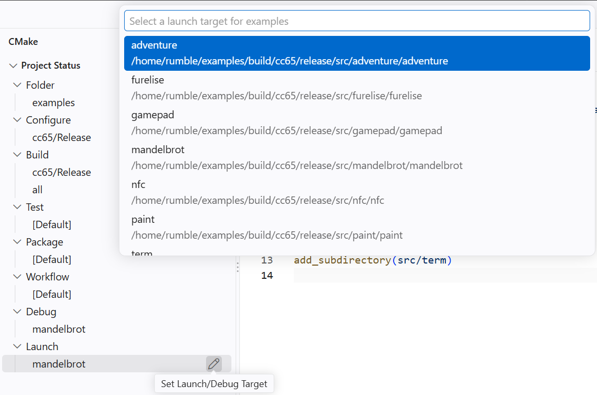
         the project's ROMs.

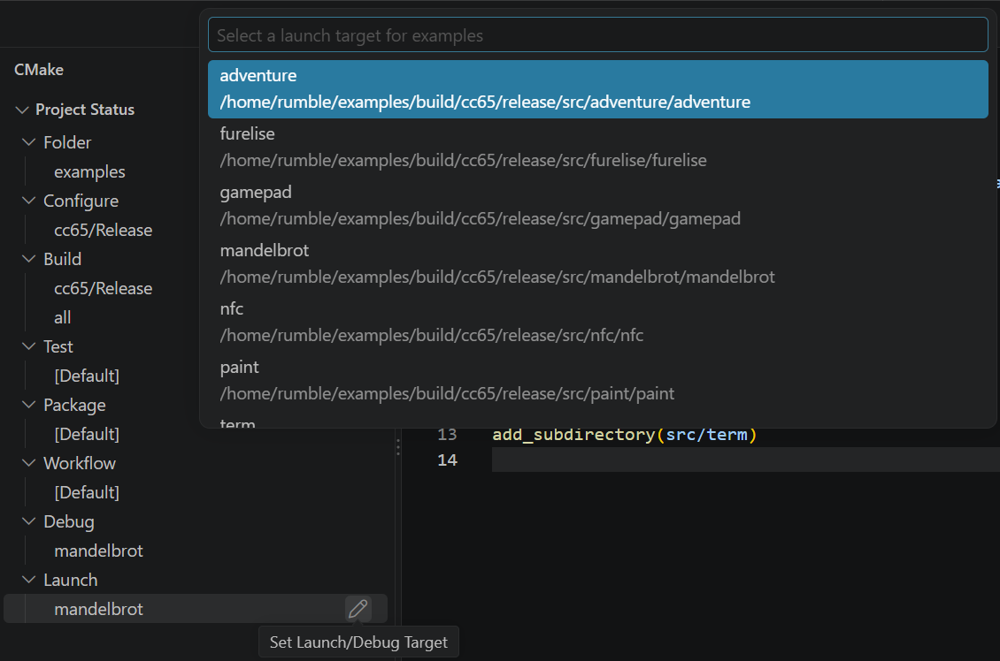
         the project's ROMs.

``rp6502_map()`` takes the target, so ``hello`` and ``setup`` can have
different XRAM layouts. Each ROM is built only after the checks pass for
every header mapped for it.

A larger project can give each ROM a directory of its own, as the
`examples <https://github.com/picocomputer/examples>`__ do:

.. code-block:: cmake

  # CMakeLists.txt
  add_subdirectory(src/hello)
  add_subdirectory(src/setup)

  # src/setup/CMakeLists.txt
  add_executable(setup)
  rp6502_map(setup xram.h "XRAM_.*")
  rp6502_asset(setup help setup.hlp)
  rp6502_executable(setup DATA default RESET default)
  target_sources(setup PRIVATE setup.c)

Each ROM is written to the matching folder of the build, such as
``build/cc65/debug/src/setup/setup.rp6502``.

.. _sdk-basic:

BASIC Programs
==============

``rp6502_basic()`` packages BASIC and the BASIC programs into one ROM.
Each program is an asset, added with ``rp6502_asset()`` as for a C
program:

.. code-block:: cmake

  cmake_minimum_required(VERSION 3.21)

  include(${CMAKE_CURRENT_LIST_DIR}/tools/rp6502.cmake)

  project(trek BASIC)

  add_executable(trek)
  rp6502_asset(trek instructions.bas src/instructions.bas)
  rp6502_asset(trek game.bas src/game.bas)
  rp6502_basic(trek instructions.bas)

A project like this one is built with the template's ``basic`` preset.

At start, the asset ``autorun.bas`` is run if the ROM has one. Otherwise
BASIC starts at the ``OK`` prompt. The optional name after the target in
``rp6502_basic()``, ``instructions.bas`` above, is written into an
``autorun.bas`` asset:

.. code-block:: text

  10 RUN "ROM:INSTRUCTIONS.BAS"

``RUN`` with ``ROM:`` and an asset name loads and runs that program. The
name can be written in any case.

A project can add its own ``autorun.bas`` asset instead, and give
``rp6502_basic()`` no name. That file is the place to set the input caps
mode with ``CAPS``, and to print a message while a large program loads:

.. code-block:: text

  10 CAPS 0
  20 PRINT "Loading..."
  30 RUN "ROM:GAME.BAS"

.. code-block:: cmake

  rp6502_asset(trek autorun.bas src/autorun.bas)
  rp6502_basic(trek)

``CAPS 0`` leaves typed letters as they are, ``CAPS 1`` makes them upper
case, and ``CAPS 2`` swaps upper and lower case. ``CAPS 1`` is the
default. With both a name in ``rp6502_basic()`` and an ``autorun.bas``
asset, the build fails with "Asset name already exists".

The BASIC interpreter comes from the latest release of
`picocomputer/msbasic <https://github.com/picocomputer/msbasic>`__. To
use a specific version instead, name it with ``BASIC``, in any form
listed in `Fetching BASIC and the Emulator`_:

.. code-block:: cmake

  rp6502_basic(trek BASIC build-96e229e instructions.bas)

The BASIC program is a CMake launch target, as a C program is, so F5 runs
it in the emulator. `Super Star Trek <https://github.com/rumbledethumps/trek>`__
is a complete BASIC project.

Web Players
===========

``rp6502_web()`` packages a ROM with the emulator and a page into a zip
that plays the program in a browser:

.. code-block:: cmake

  rp6502_web(hello)

The zip is ``web/hello.zip`` in the build folder, and the same files are
unpacked in ``web/hello/``. In VS Code, choose "RP6502-WEB" in the Run
and Debug side panel and press F5: the project is built, and the browser
opens a page with a link to every web player in the build folder. The
settings, the page and the emulator of a zip are in :ref:`Building with
CMake <web-cmake>`.

.. _sdk-fetch:

Fetching BASIC and the Emulator
===============================

BASIC for ``rp6502_basic()``, and :doc:`RP6502-WEB <web>` for
``rp6502_web()``, are downloaded into the build folder when the project is
configured. Each is the latest release of its official repository,
``picocomputer/msbasic`` or ``picocomputer/rp6502``, unless ``BASIC`` or
``EMULATOR`` names another in one of these forms:

.. list-table::
   :widths: 30 70
   :header-rows: 1

   * - Form
     - Description
   * - ``v0.36``
     - A release tag of the official repository.
   * - ``owner/repo``
     - The latest release of a repository on GitHub.
   * - ``owner/repo/tag``
     - A release tag of a repository on GitHub.
   * - ``tools/basic.rp6502``
     - A file of the project, ending in ``.rp6502`` for BASIC or ``.zip``
       for RP6502-WEB.

A failed download is a configure error. To work without a network,
download the file, commit it with the project, and name it:

.. code-block:: cmake

  rp6502_basic(trek BASIC tools/basic.rp6502 instructions.bas)
  rp6502_web(trek EMULATOR tools/rp6502-0.36-web.zip)

Registers and ``volatile``
==========================

Direct Register Access
----------------------

``volatile`` has no effect on the cc65 optimizer, so wrap C code that
accesses RIA or VIA registers directly in an optimize pragma:

.. code-block:: C

  #pragma optimize (push, off)
  static void timer_start(void)
  {
      VIA.acr = 0x40;
  }
  #pragma optimize (pop)

.. _sdk-updating:

Updating an Older Project
-------------------------

Because ``volatile`` has no effect on the cc65 optimizer, the macros of
``rp6502.h`` that accessed RIA registers directly were replaced by
library functions. The compilers installed by the commands in
`Installing the Tools`_ have the change. This table lists the changes
that break an older project.

.. list-table::
   :widths: 40 60
   :header-rows: 1

   * - Old
     - New
   * - ``xram0_struct_set(addr, type, member, val)``,
       ``xram1_struct_set``
     - ``xram0_poke8`` or ``xram0_poke16`` at
       ``addr + offsetof(type, member)``, and the ``xram1_`` versions. A
       4-byte member takes two ``xram0_poke16`` calls.
   * - ``vga_mode1_config_t``, ``vga_mode2_config_t``,
       ``vga_mode3_config_t``
     - ``mode1_config_t``, ``mode2_config_t`` and ``mode3_config_t`` from
       :ref:`vga-mode-1`, :ref:`vga-mode-2` and :ref:`vga-mode-3`, with
       the same layout.
   * - ``vga_mode4_sprite_t``, ``vga_mode4_asprite_t``,
       ``vga_mode5_sprite_t``
     - ``mode4_sprite_t`` and ``mode4_asprite_t`` from :ref:`vga-mode-4`,
       and ``mode5_sprite_t`` from :ref:`vga-mode-5`, with the same
       layout.
   * - ``xreg_ria_keyboard``, ``xreg_ria_mouse``, ``xreg_ria_gamepad``,
       ``xreg_ria_tablet``
     - The same macros from :doc:`ria`, copied into ``xram.h``.
   * - ``xreg_vga_canvas``
     - The same macro from :ref:`vga-key-registers`, copied into
       ``xram.h``.
   * - ``xreg_vga_mode(n, ...)``
     - One macro per mode from :doc:`vga`, ``xreg_vga_mode0`` to
       ``xreg_vga_mode5``. ``xreg_vga_mode(3, ...)`` becomes
       ``xreg_vga_mode3(...)``.
   * - ``phi2()``
     - ``ria_attr_get(RIA_ATTR_PHI2_KHZ)``
   * - ``code_page(cp)``
     - ``ria_attr_set(cp, RIA_ATTR_CODE_PAGE)`` when ``cp`` is not 0, then
       ``ria_attr_get(RIA_ATTR_CODE_PAGE)`` for the page in use.
   * - ``lrand()``
     - ``ria_attr_get(RIA_ATTR_LRAND)``
   * - ``ria_push_long``, ``ria_push_int``, ``ria_push_char``,
       ``ria_pop_long``, ``ria_pop_int``, ``ria_pop_char``,
       ``ria_set_axsreg``, ``ria_set_ax``, ``ria_set_a``,
       ``ria_call_int``, ``ria_call_long``
     - None. Each API call has a C function, listed in :doc:`api`. The ARGV arguments are passed to ``main()`` as ``argc``
       and ``argv`` when the program defines ``__argv_mem()``. See
       :ref:`ARGV <api-argv>`.
   * - ``RIA_READY_TX_BIT``, ``RIA_READY_RX_BIT``, ``RIA_BUSY_BIT``
     - None.
   * - ``RIA_OP_ZXSTACK``
     - ``RIA_OP_DROP_XSTACK``, or ``ria_drop()`` in C.
   * - An assembly macro, or a ca65 label, named ``xreg``
     - ``xreg`` is now a macro in ``rp6502.inc``. Rename or remove the
       one in the project.

For an older C project, save this header in the project, and include
``"rp6502-compat.h"`` in place of ``<rp6502.h>``:

.. code-block:: C
  :caption: rp6502-compat.h

  #ifndef RP6502_COMPAT_H
  #define RP6502_COMPAT_H

  #include <rp6502.h>
  #include <stddef.h>

  #define RIA_READY_TX_BIT 0x80
  #define RIA_READY_RX_BIT 0x40
  #define RIA_BUSY_BIT 0x80
  #define RIA_OP_ZXSTACK RIA_OP_DROP_XSTACK

  #define phi2() ((int)ria_attr_get(RIA_ATTR_PHI2_KHZ))
  #define code_page(cp)                                                    \
      ((cp) ? (void)ria_attr_set((cp), RIA_ATTR_CODE_PAGE) : (void)0,      \
       (int)ria_attr_get(RIA_ATTR_CODE_PAGE))
  #define lrand() ria_attr_get(RIA_ATTR_LRAND)

  #define xreg_ria_keyboard(...) xreg(0, 0, 0, __VA_ARGS__)
  #define xreg_ria_mouse(...) xreg(0, 0, 1, __VA_ARGS__)
  #define xreg_ria_gamepad(...) xreg(0, 0, 2, __VA_ARGS__)
  #define xreg_ria_tablet(...) xreg(0, 0, 3, __VA_ARGS__)
  #define xreg_vga_canvas(...) xreg(1, 0, 0, __VA_ARGS__)
  #define xreg_vga_mode(...) xreg(1, 0, 1, __VA_ARGS__)

  /* Bit tests, not ==, avoid a cc65 warning about constant comparisons.
     The casts avoid conversion warnings from the unused branches. */
  #define xram_struct_set_(n, a, size, v)                                  \
      ((size) & 1 ? xram##n##_poke8(a, (unsigned char)(v))                 \
       : (size) & 2 ? xram##n##_poke16(a, (unsigned)(v))                  \
       : (xram##n##_poke16(a, (unsigned)(v)),                              \
          xram##n##_poke16((a) + 2, (unsigned)((unsigned long)(v) >> 16))))
  #define xram0_struct_set(addr, type, member, val)                        \
      xram_struct_set_(0, (unsigned)(addr) + offsetof(type, member),       \
                       sizeof(((type *)0)->member), val)
  #define xram1_struct_set(addr, type, member, val)                        \
      xram_struct_set_(1, (unsigned)(addr) + offsetof(type, member),       \
                       sizeof(((type *)0)->member), val)

  typedef struct {
      unsigned char x_wrap, y_wrap;
      int x_pos_px, y_pos_px, width_chars, height_chars;
      unsigned xram_data_ptr, xram_palette_ptr, xram_font_ptr;
  } vga_mode1_config_t;

  typedef struct {
      unsigned char x_wrap, y_wrap;
      int x_pos_px, y_pos_px, width_tiles, height_tiles;
      unsigned xram_data_ptr, xram_palette_ptr, xram_tile_ptr;
  } vga_mode2_config_t;

  typedef struct {
      unsigned char x_wrap, y_wrap;
      int x_pos_px, y_pos_px, width_px, height_px;
      unsigned xram_data_ptr, xram_palette_ptr;
  } vga_mode3_config_t;

  typedef struct {
      int x_pos_px, y_pos_px;
      unsigned xram_sprite_ptr;
      unsigned char log_size, has_opacity_metadata;
  } vga_mode4_sprite_t;

  typedef struct {
      int transform[6];
      int x_pos_px, y_pos_px;
      unsigned xram_sprite_ptr;
      unsigned char log_size, has_opacity_metadata;
  } vga_mode4_asprite_t;

  typedef struct {
      int x_pos_px, y_pos_px;
      unsigned xram_sprite_ptr, palette_ptr;
  } vga_mode5_sprite_t;

  #endif /* RP6502_COMPAT_H */

The header does not replace ``ria_push_*``, ``ria_pop_*``, ``ria_set_*``
and ``ria_call_*``. Change those calls as the table shows.

Command Line
============

The sections above use VS Code. This section covers building and running
without it: on a build server,
in another editor, or with a 6502 program from another toolchain.

Building
--------

Each C preset is a compiler and a build type, and ``basic`` is for BASIC.
These commands list the presets, then configure and build ``cc65/Debug``,
the same as choosing that preset in VS Code.

.. code-block:: text

  cmake --list-presets
  cmake --preset cc65/Debug
  cmake --build --preset cc65/Debug

The ROM is ``build/cc65/debug/hello.rp6502``. The configure step
downloads the emulator when ``tools/`` has none, so the first configure
of a fresh copy needs a network connection.

Running on an RP6502-PICO
-------------------------

``rp6502.py run`` copies the ROM to the current folder of the monitor, or
to the ``workdir`` folder, loads it, and opens a terminal on the console.
In the terminal, Ctrl-A then X exits, and Ctrl-A then B sends a break.
The options of ``rp6502.py``, such as ``-c``, go before the subcommand,
and ``-c .rp6502`` uses the settings file that VS Code uses.

.. code-block:: text

  python3 tools/rp6502.py -c .rp6502 run build/cc65/debug/hello.rp6502

Without a settings file, name the serial port with ``-d``, or the host
and passkey for telnet with ``-d`` and ``-k``. With ``-c``, the settings
in the file take precedence over these options.

.. code-block:: text

  python3 tools/rp6502.py -d /dev/ttyUSB0 run build/cc65/debug/hello.rp6502
  python3 tools/rp6502.py -d 192.168.1.20 -k secret run build/cc65/debug/hello.rp6502

Words after the ROM's file name are passed to the ROM as its arguments.
``rp6502.py`` has these subcommands. ``python3 tools/rp6502.py --help``
lists the options that go before a subcommand, and ``--help`` after a
subcommand, as in ``python3 tools/rp6502.py execute --help``, lists the
options of that subcommand.

.. list-table::
   :widths: 20 80
   :header-rows: 1

   * - Subcommand
     - Description
   * - ``run``
     - Copy a ROM to the USB drive, load it, and open a terminal.
   * - ``upload``
     - Copy files to the USB drive. With one file, ``-o`` sets the name
       it is saved under.
   * - ``term``
     - Open a terminal on the console.
   * - ``basic``
     - Type a BASIC program into the BASIC installed on the RP6502-PICO,
       and run it.
   * - ``execute``
     - Run a ROM in the emulator. See `Running in the Emulator`_.
   * - ``emu``
     - Start the emulator as the debugger for an editor. VS Code uses
       this.
   * - ``create``
     - Package files into a ROM. See `Packaging a ROM by Hand`_.
   * - ``web``
     - Serve the web players in a build folder, and open a page in a
       browser with a link to each one. VS Code uses this. See `Web
       Players`_.

``run``, ``upload``, ``term`` and ``basic`` send a break first, which
stops the program running on the RP6502-PICO.

Running in the Emulator
-----------------------

The emulator is ``tools/rp6502-emu``, or ``tools/rp6502-emu.exe`` on
Windows and WSL. With no options, the ROM runs in a window.
:ref:`Arguments <emu-arguments>` in the emulator's datasheet lists every
option.

.. code-block:: text

  tools/rp6502-emu build/cc65/debug/hello.rp6502
  tools/rp6502-emu --headless --phi2 0 build/cc65/debug/hello.rp6502
  tools/rp6502-emu --script tests/play.txt --seed 1 build/basic/trek.rp6502

With ``--headless``, there is no window. The ROM's console is the
terminal's standard input and output, and the ROM's exit code becomes the
emulator's, so a ROM can run as a step in a script or a test.
``--phi2 0`` removes the speed limit.

With ``--script``, the input comes from an emulator :ref:`script
<emu-scripting>`, and the ROM's output is checked against the script
instead of being written to standard output, so a program that reads the
keyboard can be tested. The exit code is 0 when the script passes and 1
when it fails. A BASIC ROM does not exit when its program ends, so run it
with ``--script``.

``rp6502.py execute`` is a wrapper for ``rp6502-emu --headless`` or
``rp6502-emu --script`` that uses the ``emulator`` setting of
`The .rp6502 Settings File`_, so ``-c`` is required. ``--phi2``, ``--seed`` and
``--save-dir`` are passed to the emulator. The ROM's standard input is
empty, and the emulator's exit code becomes the command's exit code. The
second command below runs the play test of `Super Star Trek
<https://github.com/rumbledethumps/trek>`__:

.. code-block:: text

  python3 tools/rp6502.py -c .rp6502 execute build/cc65/debug/hello.rp6502
  python3 tools/rp6502.py -c .rp6502 execute --script tests/play.txt --seed 1 build/basic/trek.rp6502

Another editor can debug with the emulator through the :ref:`Debug
Adapter Protocol <emu-dap>`.

Packaging a ROM by Hand
-----------------------

``rp6502.py create`` packages files into a ROM, and
``rp6502_executable()`` uses it to build every ROM. Use it directly when
the 6502 program comes from a tool CMake doesn't run, such as an
assembler that writes a linked binary. The options it takes are:

- ``-a``: the address to load the first file at, or the name of an asset;
- ``-r``: the reset address, and ``-i`` and ``-n`` for IRQ and NMI;
- ``-o``: the ROM file to write.

The first file is the data to package. Every file after it must already
be a ROM, and its contents are merged in. A ROM that holds only named
assets is an input for merging and can't be run, because it has no reset
address.

This example packages an assembler's binary that loads at ``$0400``,
with a help file, a data file, and an image loaded into XRAM.

.. code-block:: text

  # The help text, as a named asset.
  python3 tools/rp6502.py -a help -o help.rp6502 create plvm.help

  # A data file the program opens as ROM:level1.
  python3 tools/rp6502.py -a level1 -o level1.rp6502 create level1.dat

  # An image loaded into XRAM before the 6502 starts.
  python3 tools/rp6502.py -a 0x10000 -o splash.rp6502 create splash.bin

  # The program at $0400 with a reset address, merged with the rest.
  python3 tools/rp6502.py -a 0x0400 -r 0x0400 -o plvm.rp6502 \
      create plvm.bin help.rp6502 level1.rp6502 splash.rp6502

The result is ``plvm.rp6502``. It holds memory chunks for the program at
``$0400``, the reset vector at ``$FFFC``, and the image at ``$10000``. It
also holds two named assets, ``help`` and ``level1``.

.. _sdk-rom-file-format:

ROM File Format
===============

A ROM file is a shebang line, then one group of memory chunks, then any
number of named assets. Header lines are text and end with ``\n`` or
``\r\n``. Numbers may be written in decimal (255), C-style hex (0xFF) or
MOS-style hex ($FF). This is ``hello.rp6502`` from the template, with the
binary data left out:

.. code-block:: text

  #!RP6502                         shebang
  #>$000003AC $FB52BEE0            memory chunks, 0x3AC bytes follow
  $0200 $37E $07A747B2             chunk: 0x37E bytes of program
  $FFFC $002 $AFD773D3             chunk: 2 bytes, the reset vector
  #>$0000006E $E047820E help       named asset: 0x6E bytes of help text

**Shebang** — the first line of every ROM file. The tools write:

.. code-block:: text

  #!RP6502

Any first line that starts with ``#!`` and contains ``rp6502``, in upper
or lower case, is accepted. The first line can therefore name the program
that runs the ROM. A ROM file marked executable then runs from a shell
when that program is on the PATH:

.. code-block:: text

  #!/usr/bin/env rp6502-emu

**Memory chunks** — the line after the shebang starts the group of memory
chunks, which are loaded into RAM or XRAM before the 6502 starts:

.. code-block:: text

  #>len crc

``len`` is the number of bytes that follow in the group, counting each
chunk's header line as well as its data, and ``crc`` is the CRC-32 of
those bytes. Each chunk is a header line followed by its data:

.. code-block:: text

  addr len crc

.. list-table::
   :widths: 1 20
   :header-rows: 1

   * - Field
     - Description
   * - ``addr``
     - Destination address in RAM (``$0000-$FEFF``), the 6502 vectors
       (``$FFFA-$FFFF``), or XRAM (``$10000-$1FFFF``). A ROM must set
       the reset vector at ``$FFFC-$FFFD`` to be loaded.
   * - ``len``
     - Number of bytes of binary data that follow this line. At most
       1024, and a chunk may not cross a 64 KB boundary.
   * - ``crc``
     - CRC-32 of the binary data.

**Named asset** — a file the program opens by name while it runs:

.. code-block:: text

  #>len crc name

The line is followed by ``len`` bytes of binary data. Named assets repeat
to the end of the file.

.. list-table::
   :widths: 1 20
   :header-rows: 1

   * - Field
     - Description
   * - ``len``
     - Number of bytes of binary data that follow this line.
   * - ``crc``
     - CRC-32 of the binary data.
   * - ``name``
     - The asset's name.

The CRC is CRC-32 as zlib and PNG compute it. The format sets no limit on
the number or size of named assets. Opening ``ROM:`` plus a name reads
each asset header in file order and skips its data, so a ROM with many
assets takes longer to open the last ones.
